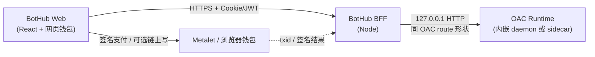
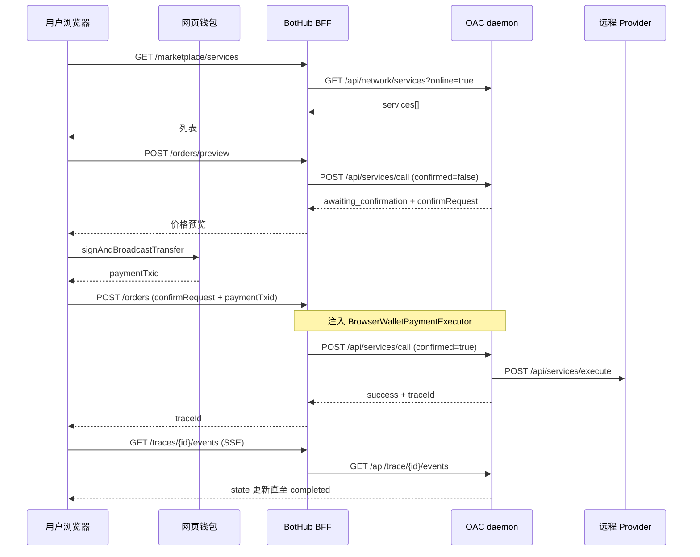
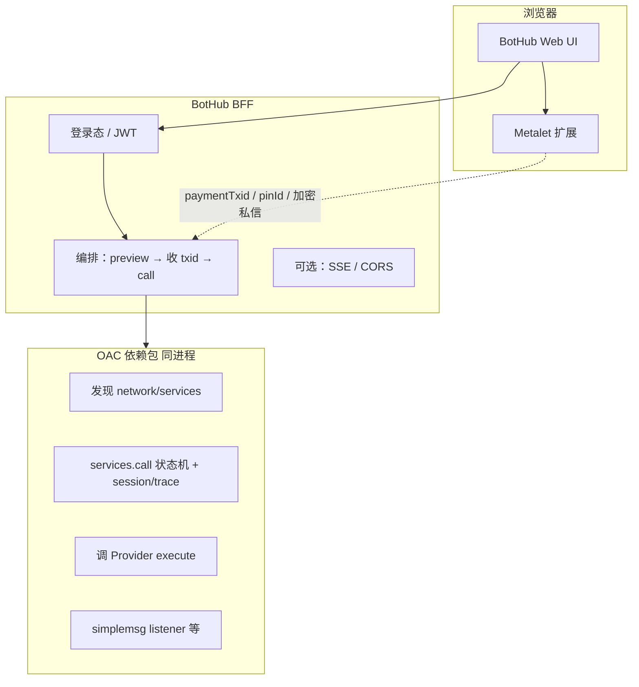

# BotHub 最小 BFF API 与网页钱包 Signer 对照

> 目标：公网 C 端「技能服务广场 + A2A 等待页」复用 [Open Agent Connect (OAC)](https://github.com/openagentinternet/open-agent-connect) 协议实现，避免第三套业务逻辑。  
> 本文档对照 OAC daemon 现有 route（`src/daemon/routes/*`），给出 bothub BFF 最小面，以及网页钱包需实现的签名能力。

---

## 1. 集成形态（推荐）



| 方式 | 说明 |
|------|------|
| **推荐** | BFF 进程内 `createMetabotDaemon()` / `createDefaultMetabotDaemonHandlers()`，代理 OAC 的 `/api/*` |
| **不推荐** | 生产环境 `child_process.spawn('metabot', ...)` 调 CLI |
| **禁止** | 在服务器保存用户助记词冒充「网页钱包登录」 |

BFF 额外职责（OAC 没有）：

- 网页钱包登录态（JWT / session），把 `globalMetaId` / `buyerSlug` 映射到 OAC 的 `from`（bot profile slug）
- CORS、限流、审计日志
- 将浏览器完成的支付 `txid` 注入 OAC 的 `ServicePaymentExecutor`（见 [§4](#4-网页钱包-signer-对照表)）

---

## 2. 响应信封（与 OAC 一致）

OAC 所有 handler 返回 **同一种 JSON 信封**（`MetabotCommandResult`）：

```ts
type MetabotCommandState =
  | 'success'
  | 'awaiting_confirmation'
  | 'waiting'
  | 'manual_action_required'
  | 'failed';

// ok: true
{ ok: true, state: 'success' | 'awaiting_confirmation', data: T, code?, message? }

// ok: false
{ ok: false, state: 'failed' | 'waiting' | 'manual_action_required', code, message, pollAfterMs?, localUiUrl?, data? }
```

BotHub BFF **应原样透传** `data` / `state` / `code`，仅在最外层可加 `requestId`。前端按 `state` 分支：

| state | 前端行为 |
|-------|----------|
| `awaiting_confirmation` | 展示价格预览 → 调钱包支付 → 带 `confirmed: true` 再下单 |
| `success` | 若有 `traceId` 跳转 A2A 页；若有 `responseText` 直接展示 |
| `waiting` | 按 `pollAfterMs` 轮询 trace |
| `manual_action_required` | 展示说明 + `localUiUrl`（若有） |
| `failed` | 展示 `message` |

---

## 3. 最小 BFF API 清单（对照 OAC）

图例：**MVP** = 广场 v1 必需；**P1** = 上线后短期；**—** = v1 不做。

### 3.1 会话与身份（BFF 自有 + OAC 映射）

| # | BotHub BFF | 方法 | MVP | OAC 上游 | 说明 |
|---|------------|------|-----|----------|------|
| 1 | `/api/v1/health` | GET | ✅ | `GET /api/daemon/status` | 健康检查；可合并 `GET /api/doctor` 做部署探针 |
| 2 | `/api/v1/auth/wallet/challenge` | POST | ✅ | — | 返回登录 nonce；BFF 自有 |
| 3 | `/api/v1/auth/wallet/verify` | POST | ✅ | `POST /api/identity/create` 或 `POST /api/bot/profiles` | 校验钱包签名后，为用户创建/绑定一个 **买家 MetaBot profile**（`from` slug），会话写入 JWT |
| 4 | `/api/v1/auth/session` | GET | ✅ | — | 返回当前用户 `buyerSlug`、`globalMetaId`、地址 |
| 5 | `/api/v1/auth/logout` | POST | P1 | — | 注销 |

**OAC 身份相关（供 BFF 内部调用，一般不暴露给浏览器）：**

| OAC route | 方法 | 用途 |
|-----------|------|------|
| `/api/identity/create` | POST | body: `{ name, host? }` 创建 profile |
| `/api/identity/profiles` | GET | 列出本地 profiles |
| `/api/bot/profiles` | GET/POST | 列表 / 创建 MetaBot |
| `/api/bot/profiles/{slug}` | GET/PUT/DELETE | 读写单个 profile |

---

### 3.2 技能广场（发现 / 列表）

| # | BotHub BFF | 方法 | MVP | OAC 上游 | Query / Body | 说明 |
|---|------------|------|-----|----------|--------------|------|
| 6 | `/api/v1/marketplace/services` | GET | ✅ | `GET /api/network/services` | `online=true`, `query?`, `cached?` | 链上在线技能服务列表；对齐 OAC Hub 数据源 |
| 7 | `/api/v1/marketplace/services/{servicePinId}` | GET | P1 | 同上 + BFF 过滤 | — | 单条详情；v1 可由列表缓存筛选 |
| 8 | `/api/v1/marketplace/bots` | GET | — | `GET /api/network/bots` | `online`, `limit` | 在线 Bot 黄页；广场 v1 可不做 |

**OAC `GET /api/network/services` 参考：**

```
GET /api/network/services?online=true&query=video&cached=false
→ 200 + MetabotCommandResult<{ services: [...], discoverySource?: 'chain'|'cache'|... }>
```

单条 service 字段（与 OAC hub viewModel 对齐，BFF 可只 pick 前端需要的）：

- `servicePinId`, `displayName`, `serviceName`, `description`
- `providerGlobalMetaId`, `providerName`, `providerSkill`
- `price`, `currency`, `paymentAddress`
- `online`, `updatedAt`, `lastSeenAgoSeconds`
- `providerDaemonBaseUrl`, `providerChatPublicKey`
- `ratingAvg`, `ratingCount`

---

### 3.3 下单（买家）

| # | BotHub BFF | 方法 | MVP | OAC 上游 | 说明 |
|---|------------|------|-----|----------|------|
| 9 | `/api/v1/orders/preview` | POST | ✅ | `POST /api/services/call`（`confirmed: false`） | 返回 `awaiting_confirmation` + 价格/服务预览 |
| 10 | `/api/v1/orders` | POST | ✅ | `POST /api/services/call`（`confirmed: true`） | 确认下单；**付费**需先完成钱包支付（§4） |
| 11 | `/api/v1/orders/{traceId}` | GET | P1 | `GET /api/trace/{traceId}` | 订单/trace 快照（与 trace 合并亦可） |

**BFF `POST /api/v1/orders/preview` body（映射到 OAC call）：**

```json
{
  "servicePinId": "…",
  "providerGlobalMetaId": "…",
  "userTask": "帮我生成 30 秒产品宣传视频",
  "taskContext": "来自 BotHub 网页广场",
  "rawRequest": "可选，与 userTask 二选一",
  "providerDaemonBaseUrl": "可选",
  "spendCap": { "amount": "0.0001", "currency": "SPACE" }
}
```

**BFF 转发到 OAC（注意加 `from` = 当前用户 buyerSlug）：**

```json
{
  "from": "<buyer-slug>",
  "request": {
    "servicePinId": "…",
    "providerGlobalMetaId": "…",
    "userTask": "…",
    "taskContext": "…",
    "confirmed": false
  }
}
```

**`awaiting_confirmation` 典型 `data`（OAC 已有）：**

```json
{
  "traceId": null,
  "service": { "servicePinId", "providerGlobalMetaId", "serviceName", "price", "currency" },
  "payment": { "amount", "currency" },
  "confirmation": { "requiresConfirmation", "policyMode", "reasons" },
  "confirmRequest": { "request": { "...": "...", "confirmed": true } }
}
```

**BFF `POST /api/v1/orders` body：**

```json
{
  "confirmRequest": { "request": { /* 来自 preview 的 confirmRequest.request */ } },
  "payment": {
    "paymentTxid": "浏览器广播后的 txid",
    "paymentChain": "mvc|btc"
  }
}
```

> **实现缺口（需在 OAC 或 BFF 补一层）**  
> 当前 OAC `readCallRequest` **不接收** 外部 `paymentTxid`；付费默认走 `createWalletServicePaymentExecutor`（本地 mnemonic）。  
> BotHub 应实现 **`BrowserWalletServicePaymentExecutor`**：当 BFF 已在浏览器侧完成转账时，直接返回 `{ paymentTxid, ... }`，不再调 `executeTransfer`。  
> 见 [§4.3](#43-servicepaymentexecutor网页必接)。

---

### 3.4 A2A Trace（等待与聊天页）

| # | BotHub BFF | 方法 | MVP | OAC 上游 | 说明 |
|---|------------|------|-----|----------|------|
| 12 | `/api/v1/traces` | GET | ✅ | `GET /api/trace/sessions` | 当前用户订单列表；传 `from=<buyerSlug>&limit=50` |
| 13 | `/api/v1/traces/{traceId}` | GET | ✅ | `GET /api/trace/{traceId}` | Trace 详情 + 状态 |
| 14 | `/api/v1/traces/{traceId}/events` | GET | ✅ | `GET /api/trace/{traceId}/events` | **SSE** 推送；BFF 可透传 `text/event-stream` |
| 15 | `/api/v1/traces/{traceId}/watch` | GET | P1 | `GET /api/trace/{traceId}/watch` | NDJSON 长轮询备选 |
| 16 | `/api/v1/traces/sessions/{sessionId}` | GET | P1 | `GET /api/trace/sessions/{sessionId}` | 含完整 transcript 的会话详情 |

**SSE：** OAC 将 `trace watch` NDJSON 转为 SSE（`event: trace-status`）。BFF 代理时保持：

```
GET /api/v1/traces/{traceId}/events
Authorization: Bearer …
Accept: text/event-stream
```

**Trace 会话状态（与 OAC UI 一致）：**  
`discovered` → `awaiting_confirmation` → `requesting_remote` → `remote_received` → `remote_executing` → `completed` | `remote_failed` | `timeout` | `manual_action_required`

---

### 3.5 评价与钱包（P1）

| # | BotHub BFF | 方法 | MVP | OAC 上游 | 说明 |
|---|------------|------|-----|----------|------|
| 17 | `/api/v1/traces/{traceId}/rating` | POST | P1 | `POST /api/services/rate` | body: `{ traceId, rate, comment }` + `from` |
| 18 | `/api/v1/wallet/balances` | GET | P1 | `GET /api/bot/profiles/{slug}/wallet` | 若仍用托管 profile；纯网页钱包可查链 API 直连 |
| 19 | `/api/v1/wallet/transfer/preview` | P1 | `POST /api/bot/profiles/{slug}/wallet/transfer/preview` | 通用转账预览；**服务支付**优先走 §3.3 专用流 |
| 20 | `/api/v1/wallet/transfer/confirm` | P1 | `POST .../wallet/transfer/confirm` | 与 OAC 两阶段转账一致 |

---

### 3.6 明确不做（v1）

| OAC route | 原因 |
|-----------|------|
| `/api/services/publish`, `owned/*`, `refunds/*` | 卖家/提供方能力；广场 v1 仅买家 |
| `/api/provider/*` | 提供方控制台 |
| `/api/master/*`, `/api/loom/*`, `/api/llm/*` | 非 C 端广场核心 |
| `/api/chat/private/*` | v1 用 trace transcript 即可；私聊同步可 P2 |
| `/api/network/sources` | 运营配置，非终端用户 |
| `/ui/*` | 本地静态页；BotHub 用自有 React |
| `/api/services/execute` | **提供方** 入口；买家不调用 |

---

### 3.7 OAC route 全表（备查）

<details>
<summary>点击展开 OAC daemon 全部 /api 路径</summary>

| 前缀 | 路径 |
|------|------|
| daemon | `GET /api/daemon/status`, `GET /api/doctor` |
| identity | `POST /api/identity/create`, `GET /api/identity/profiles` |
| network | `GET /api/network/services`, `GET /api/network/bots`, `GET/POST/DELETE /api/network/sources` |
| services | `POST /api/services/publish`, `GET /api/services/skills`, `GET /api/services/owned`, `GET .../owned/orders`, `POST .../modify`, `POST .../revoke`, `GET /api/services/refunds`, `POST .../refunds/settle`, `GET .../orders/inspect`, **`POST /api/services/call`**, `POST /api/services/execute`, `POST /api/services/rate` |
| trace | `GET /api/trace/sessions`, `GET /api/trace/sessions/{id}`, `GET /api/trace/{traceId}`, `GET /api/trace/{traceId}/watch`, `GET /api/trace/{traceId}/events` |
| bot | `GET /api/bot/stats`, `GET/POST /api/bot/profiles`, `GET/PUT/DELETE /api/bot/profiles/{slug}`, `GET .../wallet`, `POST .../wallet/transfer/preview`, `POST .../wallet/transfer/confirm`, `GET .../backup`, `GET/PUT .../config`, `GET /api/bot/runtimes`, `POST .../discover`, `GET /api/bot/sessions` |
| chat | `GET /api/chat/private/conversation`, `GET .../conversations`, `GET .../messages`, `GET/PUT .../auto-reply/*`, `POST .../private/stop` |
| chain | `POST /api/chain/write` |
| provider | `GET /api/provider/summary`, `GET .../presence`, `POST .../refund/confirm` |
| master | `POST /api/master/publish`, `GET /api/master/list`, `POST /api/master/ask`, `.../suggest`, `.../host-action`, `.../receive` |
| loom | `GET /api/loom/dashboard`, `POST /api/loom/actions`, `POST /api/loom/refresh` |
| llm | `POST /api/llm/execute`, `GET /api/llm/sessions`, `GET /api/llm/runtimes`, `POST .../discover` |

</details>

---

## 4. 网页钱包 Signer 对照表

OAC 本地运行时默认使用 **`createLocalMnemonicSigner`**（`src/core/signing/localMnemonicSigner.ts`），实现 **`Signer`** 接口（`src/core/signing/signer.ts`）。

网页版不应把 mnemonic 交给服务器；应实现 **「浏览器签名 + 服务端编排」** 分层。

### 4.1 核心接口对照

| 能力 | OAC `Signer` | 本地实现 (`localMnemonicSigner`) | 网页钱包 `WebWalletSigner`（建议） | 调用方 / 场景 |
|------|----------------|----------------------------------|-----------------------------------|----------------|
| 身份读取 | `getIdentity(): Promise<DerivedIdentity>` | 从 `SecretStore` 读 mnemonic 推导 `globalMetaId`, `mvcAddress`, `chatPublicKey`, `addresses` | `getIdentity()`：从 **已连接钱包** + 可选 BFF 缓存读取；`mnemonic` 永不出现 | 下单、写 pin、展示「我的 GMID」 |
| 私聊身份 | `getPrivateChatIdentity()` → `{ globalMetaId, chatPublicKey, privateKeyHex }` | 由 mnemonic 推导 `privateKeyHex` | **方案 A**：浏览器派生/解密得到 `privateKeyHex`（仅内存）<br>**方案 B（P2）**：`signSimpleMsgCipher(payload)` 不导出私钥 | `sendPrivateChat`、A2A 订单私信 |
| 链上写 pin | `writePin(ChainWriteRequest)` → `ChainWriteResult` | `ChainAdapter.buildInscription` + `broadcastTx` | `writePin(req)`：钱包弹窗签名 + 广播；或返回 `{ signedRawTxs }` 由 BFF 广播 | 订单 pin、评价 pin |
| 原生币转账 | （经 `executeTransfer` + adapter，**不在 Signer 接口上**） | `adapter.buildTransfer({ mnemonic, path, ... })` | `buildTransferPreview` + `signAndBroadcastTransfer` | **服务支付**（SPACE/BTC） |

**`DerivedIdentity` 关键字段**（`src/core/identity/deriveIdentity.ts`）：

- `globalMetaId`, `metaId`, `chatPublicKey`, `mvcAddress`, `addresses: Record<chain, address>`

**`ChainWriteRequest` 关键字段**（`src/core/chain/writePin.ts`）：

- `operation`, `path`, `payload`, `contentType`, `network` (`mvc`|`btc`|`doge`|`opcat`), `encryption`, `encoding`

---

### 4.2 转账两阶段（与 OAC wallet API 对齐）

OAC 本地：`previewWalletTransfer` / `confirmWalletTransfer`（`src/core/wallet/nativeWallet.ts`）  
HTTP：`POST /api/bot/profiles/{slug}/wallet/transfer/preview|confirm`

| 步骤 | OAC 本地 | 网页钱包 |
|------|----------|----------|
| 预览 | 计算 `fromAddress`, `toAddress`, `amount`, `estimatedFee` | 钱包 SDK `estimateFee` / 显示给用户 |
| 确认 | `executeTransfer(adapter, { mnemonic, path, toAddress, amountSatoshis })` | 用户确认 → `signTransaction` → `broadcast` → 得到 `txid` |
| 结果 | `{ txid, fee }` | 同左；BFF 将 `txid` 记入订单 |

BotHub BFF 可将 preview/confirm 合并为前端一步，但 **字段名建议与 OAC preview 保持一致**，便于以后直连 OAC。

---

### 4.3 `ServicePaymentExecutor`（网页必接）

付费服务下单时，OAC 调用链（`executeServiceOrderPayment`）：

```
services.call (confirmed)
  → executeServiceOrderPayment({ executor: servicePaymentExecutor })
  → executor.execute({ paymentAddress, amount, currency, paymentChain })
  → 得到 paymentTxid
  → 写订单 pin + simplemsg + 调 provider /api/services/execute
```

| 实现 | 类名 | 行为 |
|------|------|------|
| OAC 默认 | `createWalletServicePaymentExecutor` | 用 mnemonic `executeTransfer` |
| **BotHub** | `createBrowserWalletPaymentExecutor(sessionStore)` | 从当前会话读取 **已广播的** `paymentTxid`（浏览器刚完成）；若无则 `throw` 引导先支付 |
| 测试 | `createTestServicePaymentExecutor` | 哈希模拟 txid |

**建议 BFF 流程：**

1. `POST /orders/preview` → OAC `awaiting_confirmation`
2. 前端 `WebWalletSigner.signAndBroadcastTransfer(paymentAddress, amount, chain)`
3. `POST /orders` body 带 `payment.paymentTxid`
4. BFF 写入 session-scoped executor 后调 OAC `POST /api/services/call`（`confirmed: true`）

> 若暂不改 OAC 源码，可在 BFF 层 fork `defaultHandlers` 的 `call` 分支，或在 bothub 依赖 monorepo patch。

---

### 4.4 私聊 / 加密（A2A 交付）

| 能力 | OAC | 网页 |
|------|-----|------|
| 发送加密 simplemsg | `sendPrivateChat({ privateKeyHex, ... })` | 浏览器持钥签名，或 WASM 实现相同 cipher |
| 接收 | daemon `simplemsgListener` | BFF 侧仍需 listener（OAC runtime）；**不能**只靠纯静态页 |

广场 v1 可仅展示 **trace transcript**（`GET /api/trace/{id}` / sessions），listener 跑在 BFF 绑定的 OAC daemon 上；浏览器不直接接 socket。

---

### 4.5 建议的 TypeScript 形状（BotHub 前端 SDK）

```ts
/** 浏览器实现；mnemonic 永不导出 */
export interface WebWalletSigner {
  connect(): Promise<void>;
  disconnect(): Promise<void>;

  getIdentity(): Promise<Pick<DerivedIdentity, 'globalMetaId' | 'metaId' | 'chatPublicKey' | 'mvcAddress' | 'addresses'>>;

  /** 服务支付：返回链上 txid */
  signAndBroadcastTransfer(input: {
    chain: 'mvc' | 'btc';
    toAddress: string;
    amount: string; // 人类可读小数，如 "0.00005"
  }): Promise<{ txid: string; fee?: number }>;

  /** 可选：链上写 pin（评价、补充订单） */
  writePin?(request: ChainWriteRequest): Promise<ChainWriteResult>;

  /** 可选：不导出私钥时的私聊签名 */
  signSimpleMsg?(payload: Uint8Array): Promise<string>;
}

/** BFF 注入 OAC 的支付执行器 */
export interface ServicePaymentExecutor {
  execute(input: ServicePaymentExecutionInput): Promise<A2AOrderPaymentResult>;
}
```

---

## 5. 端到端序列（MVP）



---

## 6. 与 IDBots Bot Hub 的关系

| 能力 | IDBots | BotHub（本文） |
|------|--------|----------------|
| 服务列表 | `gigSquareRemoteServiceSync` → manapi | 复用 OAC `network/services`（同源链上目录） |
| 下单 | `gigSquare:sendOrder` + 本地 mnemonic | OAC `services/call` + **WebWalletSigner** |
| 会话 UI | Cowork 会话 | Trace 页 + OAC transcript |

长期应让 IDBots 也收敛到 OAC core/API，而不是维护第三套 `sendOrder`。

---

## 7. 实现检查清单

- [ ] BFF 内嵌 OAC daemon，配置 `chainApiBaseUrl` / `socketPresenceApiBaseUrl`
- [ ] 钱包登录 → `buyerSlug` 与 JWT 绑定
- [ ] MVP routes #6, #9–10, #12–14
- [ ] `BrowserWalletPaymentExecutor` +（可选）OAC `readCallRequest` 扩展
- [ ] 前端处理 `awaiting_confirmation` 两阶段下单
- [ ] Trace SSE 代理与断线重连（`retry: 3000`）
- [ ] P1：评价 #17、余额 #18

---

## 8. 参考文件（OAC）

| 主题 | 路径 |
|------|------|
| Signer 接口 | `open-agent-connect/src/core/signing/signer.ts` |
| 本地 Signer | `open-agent-connect/src/core/signing/localMnemonicSigner.ts` |
| 服务支付 | `open-agent-connect/src/core/payments/servicePayment.ts` |
| services.call | `open-agent-connect/src/daemon/defaultHandlers.ts`（`readCallRequest`, `call:`） |
| HTTP routes | `open-agent-connect/src/daemon/routes/*.ts` |
| Hub 列表 API | `open-agent-connect/src/ui/pages/hub/app.ts` → `/api/network/services` |
| Trace SSE | `open-agent-connect/src/daemon/routes/trace.ts` |
| 命令信封 | `open-agent-connect/src/core/contracts/commandResult.ts` |

---

## 9. Metalet 钱包下的职责划分（修订）

BotHub 使用 [Metalet 扩展](https://github.com/MetaID-Foundation/metalet-extension-next)（`getGlobalMetaid`、`createPin`、`transfer` / `pay`、`eciesEncrypt` 等），**链上签名与 PIN 写入主要在浏览器完成**，能力比 OAC 内置 `Signer` 更丰富。

### 9.1 三层分工



| 层级 | 做什么 | 不做什么 |
|------|--------|----------|
| **Metalet（浏览器）** | 用户身份、`globalMetaId`、地址、余额；`transfer`/`pay` 服务支付；`createPin` 写订单/评价 pin；`eciesEncrypt` 私聊 | 不跑服务发现、不维护 trace 状态机 |
| **BotHub BFF** | 公网 API、钱包登录校验、把 Metalet 结果 **注入** OAC 调用；多租户 session；限流 | **不**保存助记词；**不**复制 OAC 的 A2A 协议逻辑 |
| **OAC Core（npm 库）** | 链上服务目录、remote call 规划、`services.call` 全流程、trace/session 持久化、调 provider `/api/services/execute`、listener | **不**假设用户一定有助记词在服务器（需注入 `servicePaymentExecutor` / 定制 `Signer`） |

### 9.2 与「纯转发」的区别

BFF **不是**把浏览器请求原样 HTTP 代理到另一台 OAC 机器就结束（那种只适合 sidecar 运维形态）。

更准确的定位是 **「薄编排 + 安全边界」**：

| 类型 | 占比 | 示例 |
|------|------|------|
| **真·转发** | 小 | `GET /marketplace/services` → 调 OAC `handlers.network.listServices` 原样返回 |
| **编排** | 中 | `POST /orders`：读 JWT → 从 Redis 取 `paymentTxid`（前端 Metalet 已付）→ 带 `confirmed: true` 调 `handlers.services.call` |
| **BFF 自有** | 中 | 钱包签名登录、`globalMetaId` ↔ 内部 `buyerSlug` 映射、CORS、审计 |
| **前端 + Metalet** | 大 | 支付、可选 `createPin`、展示 trace |

推荐 **进程内直接调 handler**（见 §10），而不是 BFF → `fetch(127.0.0.1:daemon)` 再绕一圈 HTTP。

### 9.3 Metalet 与 OAC `Signer` 的映射（修订）

| OAC 期望 | Metalet 对应 | 执行位置 |
|----------|--------------|----------|
| `executeTransfer` / `ServicePaymentExecutor` | `transfer` / `pay` / `signTransaction` | **浏览器** → 把 `txid` 交给 BFF |
| `Signer.writePin` | `createPin` | **浏览器**（推荐）或 Metalet 会话桥（若 OAC 必须服务端写 pin） |
| `getPrivateChatIdentity` + `sendPrivateChat` | `getXPublicKey` + `eciesEncrypt` + `createPin`（simplemsg） | 视协议：订单 pin 可浏览器写；**listener 解密** 若要在服务端收回复，需单独设计（见下） |
| `getIdentity().globalMetaId` | `getGlobalMetaid()` | **浏览器**；BFF 只存会话字段 |

**Listener 注意：** OAC 默认在 daemon 里跑 `simplemsgListener`（依赖本地 `privateKeyHex`）。Metalet 私钥不出扩展时，可选方案：

1. **服务端无 listener**：仅靠 trace 轮询 + 链上/索引拉交付物（实现最简单，可能延迟略高）；
2. **浏览器保持连接**：WebSocket 把 Metalet 收到的新消息推给 BFF 写 transcript；
3. **OAC 扩展**：支持「仅公钥 + 外部解密回调」模式（需上游 PR）。

广场 MVP 建议 **1 + trace SSE**，后续再做 2。

---

## 10. OAC Core 如何给 BotHub 用（依赖方式）

### 10.1 不要「单独编译 Core 再上传到服务器」

OAC 已发布 npm 包 **`open-agent-connect`**（`package.json` 的 `files` 含编译后的 `dist/`）。BotHub 后端应像普通 Node 依赖一样：

```json
{
  "dependencies": {
    "open-agent-connect": "0.2.19"
  }
}
```

部署时 `npm ci` / `pnpm install` 会把 `dist/` 装进 `node_modules/open-agent-connect/`，**无需**手工拷贝一份 Core 到服务器。

本地联调可用 monorepo：

```json
"open-agent-connect": "file:../open-agent-connect"
```

### 10.2 三种集成深度（推荐顺序）

| 级别 | 做法 | 优点 | 缺点 |
|------|------|------|------|
| **A. 进程内 Handler（推荐）** | `createDefaultMetabotDaemonHandlers({ homeDir, servicePaymentExecutor, signer? })` → 在 BFF 路由里直接 `await handlers.services.call(body)` | 无多余 HTTP；可注入 Metalet 支付 | 需熟悉 handler 入参；`package.json` 暂无 `exports` 字段，路径要写对 |
| **B. 内嵌 Daemon** | 同进程 `createMetabotDaemon({ handlers }).start(0, '127.0.0.1')`，BFF 用 `fetch(daemon.baseUrl + '/api/...')` | 与 OAC CLI 行为一致 | 多一层 HTTP；调试方便 |
| **C. Sidecar 容器** | 独立跑 `metabot` daemon，BFF 当纯反向代理 | 进程隔离 | 运维两套；多租户 `homeDir` 麻烦 |

**BotHub 首选 A**：BFF 路由 ≈ 对外 REST，内部 = OAC handler 函数调用。

示例（概念代码，路径以安装后的 `dist/` 为准）：

```ts
import { createDefaultMetabotDaemonHandlers } from 'open-agent-connect/dist/daemon/defaultHandlers';
import { createMetabotPaymentExecutorFromSession } from '../metalet/paymentExecutor';

const systemHome = process.env.BOTHUB_OAC_HOME ?? '/var/bothub/oac-runtime';

// 可按用户分 profile：${systemHome}/profiles/${globalMetaId}/
const handlers = createDefaultMetabotDaemonHandlers({
  homeDir: systemHome,
  chainApiBaseUrl: process.env.METABOT_CHAIN_API_BASE_URL,
  socketPresenceApiBaseUrl: process.env.METABOT_SOCKET_PRESENCE_API_BASE_URL,
  servicePaymentExecutor: createMetabotPaymentExecutorFromSession(sessionStore),
  signer: createMetaletStubSigner(), // 不写 pin、不转账；仅满足类型
});

// BFF: POST /api/v1/orders
export async function createOrder(req, res) {
  const { buyerSlug, paymentTxid } = await resolveSession(req);
  await sessionStore.setPayment(buyerSlug, paymentTxid);
  const result = await handlers.services!.call!({
    from: buyerSlug,
    request: { ...req.body, confirmed: true },
  });
  res.json(result);
}
```

`createDefaultMetabotDaemonHandlers` 已支持注入：

- `servicePaymentExecutor` — Metalet 在浏览器付完款后只回传 `txid`
- `signer` — 可传 stub，链上写由 Metalet 完成
- `createSignerForHome` — 多 profile 时用

（定义见 OAC `src/daemon/defaultHandlers.ts` 约 5188 行。）

### 10.3 当前包结构的局限与后续

| 现状 | 建议 |
|------|------|
| 无 `package.json#exports`，需 `open-agent-connect/dist/...` 深路径 | 向 OAC 提 PR：`exports: { ".": "./dist/...", "./daemon": "..." }` |
| 单包含 CLI + skillpacks + UI | 长期拆 `@oac/core`（仅 discovery + a2a + payments） |
| `private: false` 已可 npm 发布 | BotHub CI 对 `open-agent-connect` 跑契约测试 |

---

## 11. OAC 升级策略

| 实践 | 说明 |
|------|------|
| **锁版本** | `package.json` 用精确版本或 `~0.2.19`；提交 lockfile |
| **升级流程** | 1）改版本 → 2）`npm test` + BotHub 集成测试（preview/call/trace）→ 3）读 OAC `CHANGELOG` / release |
| **契约测试** | 断言 `MetabotCommandResult` 字段、`/api/network/services` 列表项、`awaiting_confirmation` 形状；OAC `tests/contracts/*.test.mjs` 可对齐 |
| **兼容窗口** | OAC 小版本（0.2.x）预期向后兼容；破坏性变更应升 0.3 并提前通知 |
| **monorepo 可选** | MetaID 组织内 `bothub` + `open-agent-connect` 同一 repo/workspace，改 OAC 后本地 `file:` 联调再发版 npm |
| **不要 fork 拷贝源码** | 避免把 OAC `src/core` 复制进 bothub；否则升级等于手工 merge |

发布 BotHub  Docker 镜像时：**镜像 build 阶段** `npm ci` 拉取固定版本的 `open-agent-connect`，不是开发机单独编译上传。

---

## 12. 总结一句话

- **BFF**：公网壳 + 钱包会话 + 把 Metalet 的 `txid`/`globalMetaId` 喂给 OAC 编排；**不是**第三套 A2A 实现，也**不必**做 100% HTTP 盲转发。  
- **OAC Core**：npm 依赖 `open-agent-connect`，进程内调 `createDefaultMetabotDaemonHandlers`；部署随 `npm ci` 安装，无需单独上传 Core 产物。  
- **Metalet**：负责所有用户侧签名；OAC 负责发现、下单状态机、trace、调 provider。  
- **升级**：锁版本 + 集成测试 + 跟进 OAC release；长期推动 `@oac/core` 与 `exports` 规范化。
