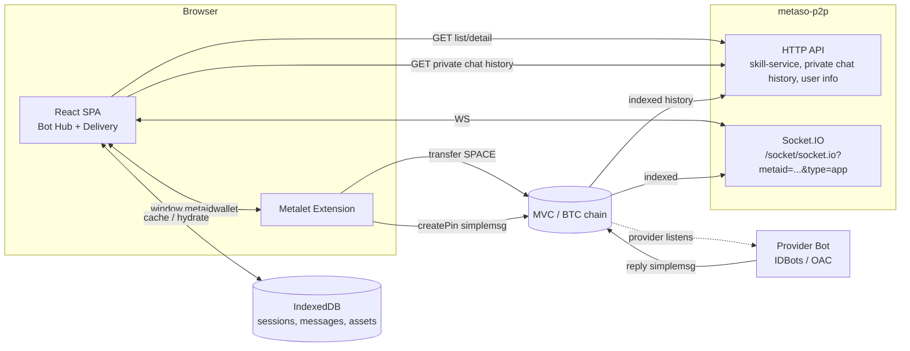

# BotHub Design

> **Status:** Approved v1.1 (2026-05-28). Decisions locked in §0.
> **Scope:** Pure frontend caller-side product for ordinary users: browse remote skill-service providers, submit a manual request with Metalet, and manage delivered digital assets in Delivery.
> **Repo:** `github.com/metaid-developers/bothub`

---

## 0. Locked Decisions

| # | Decision | Choice | Notes |
|---|----------|--------|-------|
| D1 | Frontend stack | **Vite 5 + React 18 + TypeScript 5 (strict)** | Align with IDBots renderer stack for future integration |
| D2 | UI libraries | **Tailwind CSS 3 + Headless UI + Heroicons** | Same as IDBots; **do not** copy OAC daemon HTML styling |
| D3 | State / data | **TanStack Query v5** (server) + **zustand** (wallet, WS, messages) | IDBots uses Redux; we skip Redux — our scope is simpler |
| D4 | Router | React Router v6 | — |
| D5 | WebSocket | `socket.io-client@4.8.x` | Same major as IDBots; metaso-p2p protocol |
| D6 | Wallet | Metalet only | `window.metaidwallet` |
| D7 | Backend | **None** — pure SPA → metaso-p2p | ✅ Confirmed |
| D8 | Order payload | Mirror `IDBots/src/main/shared/orderMessage.js` | Byte-for-byte contract |
| D9 | i18n | zh-CN first; typed map for en later | — |
| D10 | Repo layout | Single Vite app at repo root | No monorepo |
| D11 | Package manager | **pnpm** | Fast, strict; greenfield choice |
| D12 | Tests | Vitest + Testing Library | — |
| D13 | Lint | ESLint + typescript-eslint + Prettier | Match IDBots eslint setup |
| D14 | Visual design | **`frontend-design` skill** + [`docs/design/bothub-mockup.png`](../design/bothub-mockup.png) | Layout only; v1 API has no deliverables/examples/tiers |
| D15 | Data in dev | **`VITE_USE_AGGREGATOR_MOCK=true`** + fixtures | Aggregator API still building; flip mock off when live |
| D16 | metaso-p2p URL | **Configured per environment** | `VITE_METASO_P2P_BASE_URL` must point to a metaso-p2p deployment exposing native `/api/bot-hub/*`, private-chat history routes, and `/socket/socket.io`; do not use idchat `/chat-api/` as the BotHub backend |
| D17 | App chrome | **左上 Tab**（Bot Hub / Delivery）+ **右上连接钱包** | 设计稿未标清；实现以此为准 |
| D18 | Product audience | **Caller / buyer only** | For users who do not want to install IDBots, run Codex, or configure LLM/runtime tools |
| D19 | Request UX | **First release includes user input** | User writes a natural-language request in Bot Hub and can continue the conversation in Delivery |
| D20 | Local persistence | **IndexedDB for sessions, messages, assets** | Fast return experience after reconnect/login; metaso-p2p remains source of truth |
| D21 | Digital delivery | **First-class asset rendering and management** | Images, video, audio, and downloadable attachments are the main product value |
| D22 | Refunds/ratings | **Architecture reserved, UI deferred** | Important next features; do not implement in first release cut, but keep order identity and asset metadata ready |

### Reference projects (source of truth when unsure)

| Role | Repo / path | Use for |
|------|-------------|---------|
| **UI patterns & GigSquare** | `IDBots/IDBots` — `src/renderer/components/gigSquare/`, `src/main/shared/orderMessage.js` | Layout, order flow, card fields, i18n keys |
| **A2A delivery rendering** | `IDBots/IDBots` — `src/renderer/components/cowork/A2AMessageItem.tsx` | Delivery tags, metafile parsing, media preview/download behavior |
| **Wallet** | `metalet-extension-next` — `src/content-script/actions.ts` | `getGlobalMetaid`, `transfer`, `createPin`, `eciesEncrypt/Decrypt` |
| **HTTP aggregator API** | `metaso-p2p` — `docs/specs/2026-05-28-bot-hub-skill-service-aggregation-api.md` | List/detail contract |
| **Socket.IO** | `metaso-p2p` — `docs/IDCHAT_API_CONTRACT.md` §5 | Envelope `{M,C,D}`, private chat payload |
| **OAC UI (tech only)** | `open-agent-connect/src/ui/pages/hub/`, `trace/` | ViewModel patterns, **not** visual style — OAC serves vanilla HTML, not React |

> **Note on OAC `/ui`:** OAC hub/trace pages are TypeScript viewModels + vanilla HTML/CSS served by the Go daemon. They are **not** a React app. We align **tooling** (TS, socket.io-client, envelope shapes) with OAC/IDBots, but **React component stack** follows IDBots.

---

## 1. Goals & Non-Goals

### Goals (MVP)

- **Bot Hub**: browse online skill-services from `metaso-p2p` aggregator; filter/sort/search; service detail panel; "Pay & Request" via Metalet.
- **Manual request input**: ordinary users can describe what they want in plain language before paying/sending the order. This is not a headless A2A-only flow.
- **Delivery workspace**: receive caller-side private messages (provider replies, progress, delivered assets) over Socket.IO; render conversations grouped by order/session.
- **Digital asset management**: parse delivered images, videos, audio, and attachments; preview/download them; persist an asset index locally so returning users can quickly find previous deliverables.
- **Wallet**: Metalet login → identity (`globalMetaId`); show balance; sign transfers + simplemsg pins.

### Non-Goals (MVP)

- ❌ Skill-service runtime (no `services.call`, no provider mode, no order execution).
- ❌ Publishing or modifying services.
- ❌ Group chat, multi-user channels.
- ❌ Listening to other Bots' messages — only the logged-in user's.
- ❌ Custom backend service.
- ❌ Provider-side service management.
- ❌ Refund management and rating submission UI in the first release cut.

Refunds and ratings are important near-term features. The first release must keep stable `orderId`/`paymentTxid`/`orderReference`, provider identity, service identity, delivered asset metadata, and message txids so those flows can be added without changing the core session model.

---

## 2. System Diagram



**Key point:** BotHub never talks to a provider Bot directly. All communication is via on-chain pins. Provider responses flow back through metaso-p2p's Socket.IO push.
The local IndexedDB cache is only a client-side acceleration layer; metaso-p2p remains the source of truth for indexed private chat history.

---

## 3. Module Map

```
bothub/
├── index.html
├── package.json
├── vite.config.ts
├── tsconfig.json
├── tailwind.config.ts
├── src/
│   ├── main.tsx                       # entry
│   ├── App.tsx                        # router + layout shell
│   ├── routes/
│   │   ├── BotHub.tsx                 # /  (Bot Hub section)
│   │   └── Delivery.tsx               # /delivery
│   ├── components/
│   │   ├── layout/AppShell.tsx        # left nav (Hub / Delivery)
│   │   ├── hub/                       # cards, filters, detail panel
│   │   └── delivery/                  # session list, message list, message bubble
│   ├── wallet/
│   │   ├── metalet.ts                 # typed window.metaidwallet wrapper
│   │   ├── useWallet.ts               # zustand store + react hook
│   │   └── types.ts
│   ├── api/
│   │   ├── aggregator.ts              # fetch wrappers for /api/bot-hub/...
│   │   ├── aggregator.types.ts        # SkillServiceItem etc (from spec)
│   │   └── queries.ts                 # React Query hooks
│   ├── ws/
│   │   ├── socket.ts                  # socket.io-client setup + heartbeat
│   │   ├── envelope.ts                # {M, C, D} parsing
│   │   └── privateChat.ts             # WS_SERVER_NOTIFY_PRIVATE_CHAT handler
│   ├── delivery/
│   │   ├── messageStore.ts            # zustand store keyed by peerGlobalMetaId
│   │   ├── decrypt.ts                 # eciesDecrypt via Metalet
│   │   ├── orderParser.ts             # detect [ORDER] messages, extract metadata
│   │   ├── sessionGrouping.ts         # group messages into sessions
│   │   ├── messageParser.ts           # text/order/status/delivery/asset parsing
│   │   ├── assetParser.ts             # metafile URI + media type detection
│   │   └── deliveryDb.ts              # IndexedDB persistence facade
│   ├── order/
│   │   ├── buildOrderPayload.ts       # mirror of IDBots orderMessage.js
│   │   ├── orderMessage.ts            # parse helpers (shared with delivery)
│   │   └── flow.ts                    # high-level "Pay & Request" orchestration
│   ├── lib/
│   │   ├── format.ts                  # price, time, currency helpers
│   │   └── chain.ts                   # chain enum, asset URL helpers
│   ├── i18n/
│   │   ├── index.ts
│   │   └── zh-CN.ts
│   └── styles/
│       └── globals.css
├── tests/                             # vitest specs mirror src/
└── docs/
    └── ... (existing markdown)
```

**Single-responsibility principle:** each file does one thing. `wallet/`, `api/`, `ws/`, `order/`, `delivery/` are independent and could be tested without UI.

---

## 4. Data Flow

### 4.1 Bot Hub: list → detail

```
User opens /
  → useServicesQuery({ sortBy, filters, cursor })
    → GET /api/bot-hub/skill-service/list?...
    → renders ServiceCard[] with optimistic data
User clicks a card
  → setSelectedServiceId(item.id)
  → useServiceDetailQuery(id)
    → GET /api/bot-hub/skill-service/detail/{id}
    → renders ServiceDetailPanel
```

Lists use TanStack Query infinite-query pagination (`nextCursor`). Detail keyed by `currentPinId`. No prefetch needed for MVP — opening cards is the natural prefetch trigger.

### 4.2 Pay & Request flow

```
User clicks "Pay & Request" in ServiceDetailPanel
  → opens RequestModal (free-text + optional clarifications)
User confirms
  → validateOrderRawRequest(prompt)
  → if free: skip payment, generate orderReference
    else: await metalet.transfer({ chain, toAddress, amount, currency, mrc20Ticker?, mrc20Id? })
         → returns paymentTxid (+ commitTxid for mrc20)
  → orderPayload = buildOrderPayload({ price, currency, paymentTxid, ..., serviceId, skillName, serviceName, outputType })
  → ciphertext = metalet.eciesEncrypt({ message: orderPayload, recipientPubKey: provider.chatPubkey })
  → simplemsg = { from: gmid, to: providerGmid, content: ciphertext, contentType: 'text/plain', encryption: 'ecdh', replyPin: '' }
  → metalet.createPin({ path: '/private/chat/simplemsg', payload: JSON.stringify(simplemsg), encryption: '0' })
  → persist pending order locally
  → on success: navigate to /delivery, open session with provider
```

The exact payload structure mirrors `IDBots/src/main/shared/orderMessage.js`. Tests must include a fixture diffed against IDBots output for representative cases (free / native / mrc20).
The user-entered prompt is required for first release. Services may later add structured request schemas, but v1 keeps one plain-text request box so ordinary users can describe the desired outcome without understanding A2A protocols.

### 4.3 Delivery: WS message → rendering

```
On login (Metalet connected):
  → socket = io(`${METASO_P2P_WS_URL}/socket/socket.io?metaid=${gmid}&type=app`)
  → socket.on('connect', () => start 30s ping loop)
  → socket.on('message', envelope => {
      if (envelope.M === 'WS_SERVER_NOTIFY_PRIVATE_CHAT' && envelope.D.toGlobalMetaId === gmid) {
        const decrypted = await metalet.eciesDecrypt({ encrypted: envelope.D.content })
        const parsed = parsePrivateChatPayload(decrypted)  // text vs order/status/delivery/asset
        messageStore.append({ peerGmid: envelope.D.fromGlobalMetaId, ...parsed })
        deliveryDb.upsertMessageAndAssets(parsed)
      }
    })
```

**Sessions** = grouped by `peerGlobalMetaId` plus optional `serviceId`, `paymentTxid`, or `orderReference` from order metadata. Sessions are hydrated from IndexedDB first, then reconciled with metaso-p2p history and live Socket.IO pushes.

### 4.4 Delivery history and local cache

```
On login:
  → load cached sessions/messages/assets for wallet.globalMetaId from IndexedDB
  → render immediately with "syncing" indicator
  → fetch private chat history from metaso-p2p for known peers/orders
  → merge by pinId || txId || localClientId
  → decrypt new encrypted messages via Metalet
  → parse delivery assets and update asset index
```

IndexedDB stores only the caller's local view:
- `sessions`: order/session summary, provider/service identity, status, last activity.
- `messages`: decrypted display text when available, raw encrypted content, tx/pin metadata, direction.
- `assets`: extracted delivered files with source message id, metafile URI, resolved preview/download URLs, media kind, createdAt, and order/session id.
- `pendingOrders`: locally created orders waiting for provider replies.

Keep schema migrations explicit and small. If decryption fails, store raw content and a visible diagnostic rather than dropping the message.

### 4.5 Auth model

- No JWT, no server-side session.
- Identity = Metalet's `globalMetaId`. Persisted in `zustand` + `localStorage` for UI continuity.
- metaso-p2p's WS uses `?metaid=<gmid>` query param (the same param IDBots uses) — no server-side proof needed for MVP; metaso-p2p trusts the client about its own metaid for the purpose of *receiving* messages addressed to it. (If this is wrong, see Risk R3.)
- All on-chain writes are signed by Metalet; nothing else.

---

## 5. Order Protocol Contract (frozen)

Mirror of `IDBots/src/main/shared/orderMessage.js`. The output is a multi-line text encrypted via ECDH and posted to `/private/chat/simplemsg`.

```
[ORDER] <one-line display summary>
<raw_request>
<full user-input prompt, up to 4000 chars>
</raw_request>
支付金额 <price> <currency>
txid: <paymentTxid>                # OR  order id: <orderReference> for free orders
payment chain: <mvc|btc|doge>
settlement kind: <native|mrc20>
mrc20 ticker: <TICKER>             # only if mrc20
mrc20 id: <MRC20_ID>               # only if mrc20
commit txid: <commitTxid>          # only if mrc20
service id: <currentPinId>
skill name: <providerSkill>
output type: <text|image|video|audio|other>
```

**Rules** (verbatim from `buildOrderPayload`):
- Free orders (`price === 0`): omit payment settlement metadata lines, generate `orderReference`.
- Currency `XXX-MRC20` implies `settlementKind=mrc20`, `paymentChain=btc`, and triggers mrc20 lines.
- All free-form text is single-line normalized; raw_request preserves newlines inside the tag.

A Vitest fixture compares our `buildOrderPayload` output against snapshots derived from IDBots source for free / native / mrc20 cases.

---

## 6. Delivery Message and Asset Contract

Delivery must parse provider replies as a message stream, not as a single final response. The first release supports the protocol forms already used by IDBots A2A rendering:

| Form | Meaning | First-release behavior |
|------|---------|------------------------|
| Plain text / markdown | Provider reply, clarification, progress note | Render in timeline; update session last message |
| `[ORDER_STATUS:<txid>] ...` | Structured order/progress status | Render as status message; derive `in_progress` when possible |
| `[DELIVERY:<txid>] { "result": "..." }` | Digital delivery payload | Render result text; parse all contained asset URIs |
| `[ORDER_END:<txid>] ...` | Provider says order is complete | Mark session `delivered` if no stronger failure state exists |
| `[NeedsRating:<txid>] ...` | Provider requests rating | Recognize for future rating flow; first release may show completion state without rating UI |
| `metafile://...` in any renderable content | Delivered file reference | Extract into the asset index and Delivered Assets panel |

Asset handling:
- `image`: inline preview with download/open fallback.
- `video`: `<video controls>` preview with download fallback.
- `audio`: `<audio controls>` preview with download fallback.
- `download`: generic file card with filename, pinId, copy URI, and open/download action.

The parser must keep the raw message content, extracted display text, delivery tag metadata, and every asset reference. This preserves evidence for later refunds and makes ratings attachable to the correct order.

---

## 7. Metalet API surface used

From `metalet-extension-next/src/content-script/actions.ts`:

| Action | Used for |
|--------|----------|
| `connect()` / `omniConnect()` | initial wallet connect |
| `getGlobalMetaid()` | identity on login |
| `getBalance()` | optional balance display |
| `signMessage({ message })` | only if D7 changes and we need server auth |
| `transfer({ tasks })` | SPACE/MRC20 payment for paid orders |
| `pay({ transactions })` | alternative tx signing path if needed |
| `createPin({ ... })` | publishing the encrypted simplemsg order |
| `eciesEncrypt({ message })` | encrypting order payload to provider chatPubkey |
| `eciesDecrypt({ encrypted })` | decrypting incoming simplemsg in Delivery |
| `on(event, handler)` | wallet state change events |

A thin TS wrapper in `src/wallet/metalet.ts` exposes typed promises around `window.metaidwallet.*`. No business logic.

---

## 8. Aggregator API consumption

Consumes the two endpoints defined in `metaso-p2p/docs/specs/2026-05-28-bot-hub-skill-service-aggregation-api.md`:

- `GET /api/bot-hub/skill-service/list` — list with cursor
- `GET /api/bot-hub/skill-service/detail/{serviceId}` — detail

Types are codegen'd by hand into `src/api/aggregator.types.ts` based on the spec; one `SkillServiceItem` shape + envelope types. No OpenAPI / codegen tooling in MVP.

Error handling: any non-zero `code` is an error. `40400` → show empty state; `40000` → form error; `50000` → toast + retry option.

---

## 9. State Stores

| Store | Purpose | Library |
|-------|---------|---------|
| Wallet | `globalMetaId`, address(es), balance, connection state | zustand |
| Server data | services list, detail, paginated | TanStack Query |
| WS | socket instance, connection state, last error | zustand |
| Messages | per-peer message arrays + session groupings | zustand (with `subscribeWithSelector`) |
| Delivery cache | sessions, messages, delivered assets, pending orders | IndexedDB through a thin typed facade |
| Pending orders | locally-tracked "I just sent an order, waiting for first reply" | zustand + IndexedDB |

No global store object — each domain has its own. Stores never import UI; UI imports stores via hooks.

---

## 10. Risks

| # | Risk | Mitigation |
|---|------|------------|
| R1 | metaso-p2p CORS blocks browser origin | confirm before MVP; if blocked, add thin Caddy/nginx reverse proxy on bothub domain |
| R2 | Order payload format changes in IDBots → providers reject ours | freeze our copy + add a contract test against an IDBots fixture; track upstream |
| R3 | Anyone can subscribe to anyone's WS feed by passing their `metaid=` (no auth) | acceptable for MVP if messages are E2E-encrypted (they are); confirm with metaso-p2p maintainers; otherwise add signed-token auth |
| R4 | Provider may take many minutes to reply; UX needs progress feedback | render "waiting for provider" state + push notification permission ask (later) |
| R5 | MRC20 payments need 2 txids (commit + reveal); Metalet API ergonomics unknown for browser | spike Metalet `transfer({ tasks })` for MRC20 early in M5; fall back to native-only if MVP timeline is tight |
| R6 | Decryption errors (wrong key, broken cipher) silently lose messages | log + show in a debug panel; never throw away the raw payload |
| R7 | Browser storage can be cleared or quota-limited | treat IndexedDB as cache; always support metaso-p2p history re-sync |
| R8 | Large media previews can be slow or fail CORS/range requests | prefer direct metafile URL previews, fall back to download cards with clear status |
| R9 | Refund/rating flows need historical proof | preserve order/payment/service/provider/message ids in the first-release data model |

---

## 11. Testing Strategy

- **Pure modules** (`buildOrderPayload`, `parseSimpleMsg`, `sessionGrouping`, `messageParser`, `assetParser`, format helpers): Vitest with fixtures. **Required for M5+.**
- **API client / WS handlers**: Vitest with `msw` for HTTP and a `socket.io-mock` for WS.
- **IndexedDB facade**: Vitest/fake-indexeddb-style coverage for migrations, dedupe, asset extraction, and wallet-scoped reads.
- **Wallet wrapper**: mocked `window.metaidwallet` for unit tests; a real-wallet manual checklist for e2e.
- **UI components**: light snapshot / behavior tests with Testing Library. Skip visual regression in MVP.
- **End-to-end**: optional Playwright against staging metaso-p2p; not a blocker for MVP.

Per AGENTS.md #4 "Goal-Driven Execution", each milestone has explicit "verify" steps in the plan.

---

## 12. What's Explicitly Deferred

| Feature | Why deferred |
|---------|--------------|
| Refund flow (initiate refund as buyer) | Deferred from first release UI, but order/payment/message metadata must be preserved for it |
| Rating submission | Deferred from first release UI, but delivered/completed session status must make it easy to add |
| Provider profile page | redundant with detail panel for MVP |
| Multi-wallet (non-Metalet) | scope creep |
| Push notifications | browser permissions UX needs separate design |
| File upload from user (multipart input to a service) | needs metafile UX; out of scope |
| Server-side analytics | no backend means no server analytics; can add later |

---

## 13. References

- Aggregator API spec: `metaso-p2p/docs/specs/2026-05-28-bot-hub-skill-service-aggregation-api.md`
- Socket.IO contract: `metaso-p2p/docs/IDCHAT_API_CONTRACT.md` §5
- Order payload reference: `IDBots/src/main/shared/orderMessage.js`
- Delivery rendering reference: `IDBots/src/renderer/components/cowork/A2AMessageItem.tsx`
- Metalet actions: `metalet-extension-next/src/content-script/actions.ts`
- Earlier architecture notes: [`bothub-thin-architecture.md`](./bothub-thin-architecture.md), [`aggregator-contract.md`](./aggregator-contract.md)
