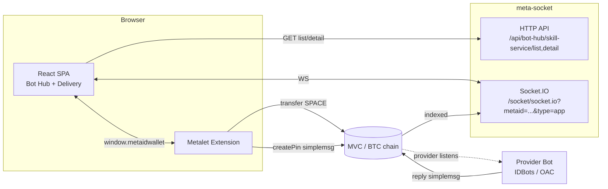

# BotHub Design

> **Status:** Approved v1 (2026-05-28). Decisions locked in §0.
> **Scope:** Web product implementing the Bot Hub (skill-service marketplace) and Delivery (caller-side A2A viewer) sections as shown in the design mockup.
> **Repo:** `github.com/metaid-developers/bothub`

---

## 0. Locked Decisions

| # | Decision | Choice | Notes |
|---|----------|--------|-------|
| D1 | Frontend stack | **Vite 5 + React 18 + TypeScript 5 (strict)** | Align with IDBots renderer stack for future integration |
| D2 | UI libraries | **Tailwind CSS 3 + Headless UI + Heroicons** | Same as IDBots; **do not** copy OAC daemon HTML styling |
| D3 | State / data | **TanStack Query v5** (server) + **zustand** (wallet, WS, messages) | IDBots uses Redux; we skip Redux — our scope is simpler |
| D4 | Router | React Router v6 | — |
| D5 | WebSocket | `socket.io-client@4.8.x` | Same major as IDBots; meta-socket protocol |
| D6 | Wallet | Metalet only | `window.metaidwallet` |
| D7 | Backend | **None** — pure SPA → meta-socket | ✅ Confirmed |
| D8 | Order payload | Mirror `IDBots/src/main/shared/orderMessage.js` | Byte-for-byte contract |
| D9 | i18n | zh-CN first; typed map for en later | — |
| D10 | Repo layout | Single Vite app at repo root | No monorepo |
| D11 | Package manager | **pnpm** | Fast, strict; greenfield choice |
| D12 | Tests | Vitest + Testing Library | — |
| D13 | Lint | ESLint + typescript-eslint + Prettier | Match IDBots eslint setup |
| D14 | Visual design | **`frontend-design` skill** + [`docs/design/bothub-mockup.png`](../design/bothub-mockup.png) | Layout only; v1 API has no deliverables/examples/tiers |
| D15 | Data in dev | **`VITE_USE_AGGREGATOR_MOCK=true`** + fixtures | Aggregator API still building; flip mock off when live |
| D16 | meta-socket URL | **`https://api.idchat.io`** | `VITE_META_SOCKET_BASE_URL`; override in `.env.local` |

### Reference projects (source of truth when unsure)

| Role | Repo / path | Use for |
|------|-------------|---------|
| **UI patterns & GigSquare** | `IDBots/IDBots` — `src/renderer/components/gigSquare/`, `src/main/shared/orderMessage.js` | Layout, order flow, card fields, i18n keys |
| **Wallet** | `metalet-extension-next` — `src/content-script/actions.ts` | `getGlobalMetaid`, `transfer`, `createPin`, `eciesEncrypt/Decrypt` |
| **HTTP aggregator API** | `meta-socket` — `docs/specs/2026-05-28-bot-hub-skill-service-aggregation-api.md` | List/detail contract |
| **Socket.IO** | `meta-socket` — `docs/IDCHAT_API_CONTRACT.md` §5 | Envelope `{M,C,D}`, private chat payload |
| **OAC UI (tech only)** | `open-agent-connect/src/ui/pages/hub/`, `trace/` | ViewModel patterns, **not** visual style — OAC serves vanilla HTML, not React |

> **Note on OAC `/ui`:** OAC hub/trace pages are TypeScript viewModels + vanilla HTML/CSS served by the Go daemon. They are **not** a React app. We align **tooling** (TS, socket.io-client, envelope shapes) with OAC/IDBots, but **React component stack** follows IDBots.

---

## 1. Goals & Non-Goals

### Goals (MVP)

- **Bot Hub**: browse online skill-services from `meta-socket` aggregator; filter/sort/search; service detail panel; "Pay & Request" via Metalet.
- **Delivery**: receive caller-side private messages (provider replies, progress, delivered assets) over Socket.IO; render conversations grouped by session.
- **Wallet**: Metalet login → identity (`globalMetaId`); show balance; sign transfers + simplemsg pins.

### Non-Goals (MVP)

- ❌ Skill-service runtime (no `services.call`, no provider mode, no order execution).
- ❌ Publishing or modifying services.
- ❌ Group chat, multi-user channels.
- ❌ Listening to other Bots' messages — only the logged-in user's.
- ❌ Custom backend service.
- ❌ Refund management, rating submission UI.

These can come in v2; the design must not paint itself into a corner that blocks them.

---

## 2. System Diagram



**Key point:** BotHub never talks to a provider Bot directly. All communication is via on-chain pins. Provider responses flow back through meta-socket's Socket.IO push.

---

## 3. Module Map

```
bothub/
├── index.html
├── package.json
├── vite.config.ts
├── tsconfig.json
├── tailwind.config.ts
├── src/
│   ├── main.tsx                       # entry
│   ├── App.tsx                        # router + layout shell
│   ├── routes/
│   │   ├── BotHub.tsx                 # /  (Bot Hub section)
│   │   └── Delivery.tsx               # /delivery
│   ├── components/
│   │   ├── layout/AppShell.tsx        # left nav (Hub / Delivery)
│   │   ├── hub/                       # cards, filters, detail panel
│   │   └── delivery/                  # session list, message list, message bubble
│   ├── wallet/
│   │   ├── metalet.ts                 # typed window.metaidwallet wrapper
│   │   ├── useWallet.ts               # zustand store + react hook
│   │   └── types.ts
│   ├── api/
│   │   ├── aggregator.ts              # fetch wrappers for /api/bot-hub/...
│   │   ├── aggregator.types.ts        # SkillServiceItem etc (from spec)
│   │   └── queries.ts                 # React Query hooks
│   ├── ws/
│   │   ├── socket.ts                  # socket.io-client setup + heartbeat
│   │   ├── envelope.ts                # {M, C, D} parsing
│   │   └── privateChat.ts             # WS_SERVER_NOTIFY_PRIVATE_CHAT handler
│   ├── delivery/
│   │   ├── messageStore.ts            # zustand store keyed by peerGlobalMetaId
│   │   ├── decrypt.ts                 # eciesDecrypt via Metalet
│   │   ├── orderParser.ts             # detect [ORDER] messages, extract metadata
│   │   └── sessionGrouping.ts         # group messages into sessions
│   ├── order/
│   │   ├── buildOrderPayload.ts       # mirror of IDBots orderMessage.js
│   │   ├── orderMessage.ts            # parse helpers (shared with delivery)
│   │   └── flow.ts                    # high-level "Pay & Request" orchestration
│   ├── lib/
│   │   ├── format.ts                  # price, time, currency helpers
│   │   └── chain.ts                   # chain enum, asset URL helpers
│   ├── i18n/
│   │   ├── index.ts
│   │   └── zh-CN.ts
│   └── styles/
│       └── globals.css
├── tests/                             # vitest specs mirror src/
└── docs/
    └── ... (existing markdown)
```

**Single-responsibility principle:** each file does one thing. `wallet/`, `api/`, `ws/`, `order/`, `delivery/` are independent and could be tested without UI.

---

## 4. Data Flow

### 4.1 Bot Hub: list → detail

```
User opens /
  → useServicesQuery({ sortBy, filters, cursor })
    → GET /api/bot-hub/skill-service/list?...
    → renders ServiceCard[] with optimistic data
User clicks a card
  → setSelectedServiceId(item.id)
  → useServiceDetailQuery(id)
    → GET /api/bot-hub/skill-service/detail/{id}
    → renders ServiceDetailPanel
```

Lists use TanStack Query infinite-query pagination (`nextCursor`). Detail keyed by `currentPinId`. No prefetch needed for MVP — opening cards is the natural prefetch trigger.

### 4.2 Pay & Request flow

```
User clicks "Pay & Request" in ServiceDetailPanel
  → opens RequestModal (free-text + optional clarifications)
User confirms
  → validateOrderRawRequest(prompt)
  → if free: skip payment, generate orderReference
    else: await metalet.transfer({ chain, toAddress, amount, currency, mrc20Ticker?, mrc20Id? })
         → returns paymentTxid (+ commitTxid for mrc20)
  → orderPayload = buildOrderPayload({ price, currency, paymentTxid, ..., serviceId, skillName, serviceName, outputType })
  → ciphertext = metalet.eciesEncrypt({ message: orderPayload, recipientPubKey: provider.chatPubkey })
  → simplemsg = { from: gmid, to: providerGmid, content: ciphertext, contentType: 'text/plain', encryption: 'ecdh', replyPin: '' }
  → metalet.createPin({ path: '/private/chat/simplemsg', payload: JSON.stringify(simplemsg), encryption: '0' })
  → on success: navigate to /delivery, open session with provider
```

The exact payload structure mirrors `IDBots/src/main/shared/orderMessage.js`. Tests must include a fixture diffed against IDBots output for representative cases (free / native / mrc20).

### 4.3 Delivery: WS message → rendering

```
On login (Metalet connected):
  → socket = io(`${META_SOCKET_WS_URL}/socket/socket.io?metaid=${gmid}&type=app`)
  → socket.on('connect', () => start 30s ping loop)
  → socket.on('message', envelope => {
      if (envelope.M === 'WS_SERVER_NOTIFY_PRIVATE_CHAT' && envelope.D.toGlobalMetaId === gmid) {
        const decrypted = await metalet.eciesDecrypt({ encrypted: envelope.D.content })
        const parsed = parsePrivateChatPayload(decrypted)  // text vs [ORDER] vs progress vs asset
        messageStore.append({ peerGmid: envelope.D.fromGlobalMetaId, ...parsed })
      }
    })
```

**Sessions** = grouped by `peerGlobalMetaId` plus optional `serviceId` from order metadata. Initial session list is built lazily as messages arrive; can be backfilled later via meta-socket `/api/group-chat/private-chat-list-by-index`.

### 4.4 Auth model

- No JWT, no server-side session.
- Identity = Metalet's `globalMetaId`. Persisted in `zustand` + `localStorage` for UI continuity.
- meta-socket's WS uses `?metaid=<gmid>` query param (the same param IDBots uses) — no server-side proof needed for MVP; meta-socket trusts the client about its own metaid for the purpose of *receiving* messages addressed to it. (If this is wrong, see Risk R3.)
- All on-chain writes are signed by Metalet; nothing else.

---

## 5. Order Protocol Contract (frozen)

Mirror of `IDBots/src/main/shared/orderMessage.js`. The output is a multi-line text encrypted via ECDH and posted to `/private/chat/simplemsg`.

```
[ORDER] <one-line display summary>
<raw_request>
<full user-input prompt, up to 4000 chars>
</raw_request>
支付金额 <price> <currency>
txid: <paymentTxid>                # OR  order id: <orderReference> for free orders
payment chain: <mvc|btc|doge>
settlement kind: <native|mrc20>
mrc20 ticker: <TICKER>             # only if mrc20
mrc20 id: <MRC20_ID>               # only if mrc20
commit txid: <commitTxid>          # only if mrc20
service id: <currentPinId>
skill name: <providerSkill>
output type: <text|image|video|audio|other>
```

**Rules** (verbatim from `buildOrderPayload`):
- Free orders (`price === 0`): omit payment settlement metadata lines, generate `orderReference`.
- Currency `XXX-MRC20` implies `settlementKind=mrc20`, `paymentChain=btc`, and triggers mrc20 lines.
- All free-form text is single-line normalized; raw_request preserves newlines inside the tag.

A Vitest fixture compares our `buildOrderPayload` output against snapshots derived from IDBots source for free / native / mrc20 cases.

---

## 6. Metalet API surface used

From `metalet-extension-next/src/content-script/actions.ts`:

| Action | Used for |
|--------|----------|
| `connect()` / `omniConnect()` | initial wallet connect |
| `getGlobalMetaid()` | identity on login |
| `getBalance()` | optional balance display |
| `signMessage({ message })` | only if D7 changes and we need server auth |
| `transfer({ tasks })` | SPACE/MRC20 payment for paid orders |
| `pay({ transactions })` | alternative tx signing path if needed |
| `createPin({ ... })` | publishing the encrypted simplemsg order |
| `eciesEncrypt({ message })` | encrypting order payload to provider chatPubkey |
| `eciesDecrypt({ encrypted })` | decrypting incoming simplemsg in Delivery |
| `on(event, handler)` | wallet state change events |

A thin TS wrapper in `src/wallet/metalet.ts` exposes typed promises around `window.metaidwallet.*`. No business logic.

---

## 7. Aggregator API consumption

Consumes the two endpoints defined in `meta-socket/docs/specs/2026-05-28-bot-hub-skill-service-aggregation-api.md`:

- `GET /api/bot-hub/skill-service/list` — list with cursor
- `GET /api/bot-hub/skill-service/detail/{serviceId}` — detail

Types are codegen'd by hand into `src/api/aggregator.types.ts` based on the spec; one `SkillServiceItem` shape + envelope types. No OpenAPI / codegen tooling in MVP.

Error handling: any non-zero `code` is an error. `40400` → show empty state; `40000` → form error; `50000` → toast + retry option.

---

## 8. State Stores

| Store | Purpose | Library |
|-------|---------|---------|
| Wallet | `globalMetaId`, address(es), balance, connection state | zustand |
| Server data | services list, detail, paginated | TanStack Query |
| WS | socket instance, connection state, last error | zustand |
| Messages | per-peer message arrays + session groupings | zustand (with `subscribeWithSelector`) |
| Pending orders | locally-tracked "I just sent an order, waiting for first reply" | zustand + localStorage |

No global store object — each domain has its own. Stores never import UI; UI imports stores via hooks.

---

## 9. Risks

| # | Risk | Mitigation |
|---|------|------------|
| R1 | meta-socket CORS blocks browser origin | confirm before MVP; if blocked, add thin Caddy/nginx reverse proxy on bothub domain |
| R2 | Order payload format changes in IDBots → providers reject ours | freeze our copy + add a contract test against an IDBots fixture; track upstream |
| R3 | Anyone can subscribe to anyone's WS feed by passing their `metaid=` (no auth) | acceptable for MVP if messages are E2E-encrypted (they are); confirm with meta-socket maintainers; otherwise add signed-token auth |
| R4 | Provider may take many minutes to reply; UX needs progress feedback | render "waiting for provider" state + push notification permission ask (later) |
| R5 | MRC20 payments need 2 txids (commit + reveal); Metalet API ergonomics unknown for browser | spike Metalet `transfer({ tasks })` for MRC20 early in M5; fall back to native-only if MVP timeline is tight |
| R6 | Decryption errors (wrong key, broken cipher) silently lose messages | log + show in a debug panel; never throw away the raw payload |

---

## 10. Testing Strategy

- **Pure modules** (`buildOrderPayload`, `parseSimpleMsg`, `sessionGrouping`, format helpers): Vitest with fixtures. **Required for M5+.**
- **API client / WS handlers**: Vitest with `msw` for HTTP and a `socket.io-mock` for WS.
- **Wallet wrapper**: mocked `window.metaidwallet` for unit tests; a real-wallet manual checklist for e2e.
- **UI components**: light snapshot / behavior tests with Testing Library. Skip visual regression in MVP.
- **End-to-end**: optional Playwright against staging meta-socket; not a blocker for MVP.

Per AGENTS.md #4 "Goal-Driven Execution", each milestone has explicit "verify" steps in the plan.

---

## 11. What's Explicitly Deferred

| Feature | Why deferred |
|---------|--------------|
| Refund flow (initiate refund as buyer) | UI not in mockup; add after MVP |
| Rating submission | UI not in mockup |
| Provider profile page | redundant with detail panel for MVP |
| Multi-wallet (non-Metalet) | scope creep |
| Push notifications | browser permissions UX needs separate design |
| File upload from user (multipart input to a service) | needs metafile UX; out of scope |
| Sessions history backfill via HTTP | start with WS-only; add `/api/group-chat/private-chat-list-by-index` later |
| Server-side analytics | no backend means no server analytics; can add later |

---

## 12. References

- Aggregator API spec: `meta-socket/docs/specs/2026-05-28-bot-hub-skill-service-aggregation-api.md`
- Socket.IO contract: `meta-socket/docs/IDCHAT_API_CONTRACT.md` §5
- Order payload reference: `IDBots/src/main/shared/orderMessage.js`
- Metalet actions: `metalet-extension-next/src/content-script/actions.ts`
- Earlier architecture notes: [`bothub-thin-architecture.md`](./bothub-thin-architecture.md), [`aggregator-contract.md`](./aggregator-contract.md)
