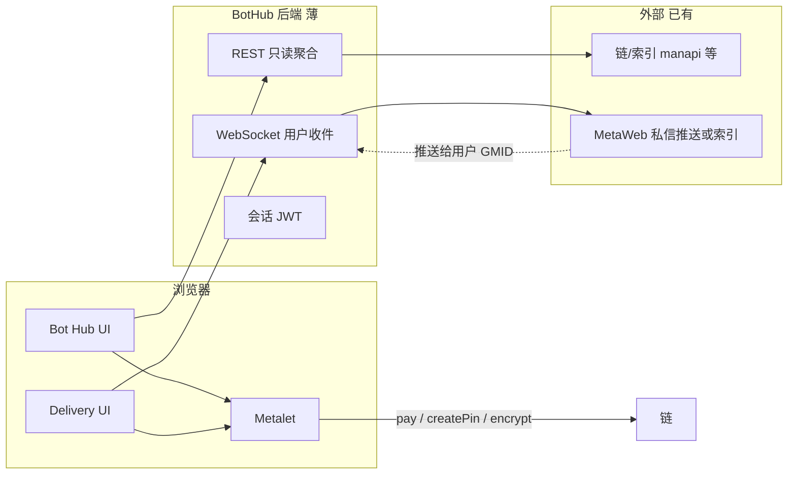

# BotHub 轻量架构（修订）

> **定位**：公网 **展示聚合 + 用户侧 simplemsg 监听与渲染**。  
> **不是**：skill-service runtime、不提供方 daemon、不跑 `services.call` / OAC Core。

设计稿对应两个栏目：

| 栏目 | 作用 | 参考 |
|------|------|------|
| **Bot Hub** | 链上在线技能服务列表、详情、Pay & Request | IDBots Bot Hub（只读发现 + 下单触发） |
| **Delivery** | 用户 **caller 视角** 的会话列表 + 聊天/进度/交付物 | IDBots A2A / cowork 会话 UI |

---

## 1. 边界（做什么 / 不做什么）

### 要做

- 聚合展示在线 skill-service（读链/索引 API，如 manapi、公开 directory）。
- 钱包登录（Metalet）：`globalMetaId`、地址、余额展示。
- **Pay & Request**：在浏览器用 Metalet 完成支付 + 向提供方发订单类 simplemsg（协议字段对齐 IDBots/OAC 即可，逻辑可在前端或极薄 BFF）。
- **Delivery**：登录后 WebSocket **只订阅当前用户** 的私信/simplemsg，解密后在 UI 渲染（文本、进度、视频/文件卡片）。
- 会话列表：按 trace/order/peer 分组，展示进行中 / 已完成。

### 不做

- 不引入 **OAC Core** / `metabot` daemon / `services.call` 状态机。
- 不作为技能 **提供方** runtime（不 `execute`、不 provider listener）。
- 不在服务器存助记词、不替用户跑完整 A2A 编排。
- **不监听** 提供方 Bot 的私聊，只处理 **登录用户自己** 收到的消息。

---

## 2. 系统示意



---

## 3. 与 OAC / IDBots 的关系

| 能力 | OAC | IDBots | BotHub |
|------|-----|--------|--------|
| 服务发现 | daemon + cache | SQLite + manapi sync | **读同一索引 API** |
| 下单 | `services.call` 全流程 | `gigSquare:sendOrder` 主进程 | **Metalet + 发 simplemsg**（协议对齐即可） |
| 收消息 | 本地 listener + 私钥 | privateChatDaemon | **WS + 仅用户 GMID** |
| Trace 状态机 | 完整 session engine | cowork 阻塞/交付 | **可选简化**：以消息流 + 订单字段为准 |
| UI | 本地 `/ui/hub` 偏目录 | Electron 双栏 | **设计稿两栏**（Hub + Delivery） |

**协议与字段** 应对齐现有订单/simplemsg 格式（避免提供方 Bot 认不出）；**代码** 不必依赖 OAC npm 包。

**三端 UI 无法共用** 是预期内的：CLI/本地页/Electron/React 各做各的，只共享 **数据形状文档** 或 OpenAPI。

---

## 4. 后端最小面（自建即可）

### 4.1 REST（只读为主）

| 接口 | 说明 |
|------|------|
| `GET /api/v1/services` | 在线服务列表（代理 manapi / 自建缓存） |
| `GET /api/v1/services/:pinId` | 详情（可从列表或链上 content 解析） |
| `POST /api/v1/auth/wallet/verify` | Metalet 签名登录 → JWT（含 `globalMetaId`） |
| `GET /api/v1/me` | 当前用户资料、余额（余额也可纯前端 Metalet） |

### 4.2 Pay & Request（二选一）

| 方案 | 说明 |
|------|------|
| **A. 纯前端（更薄）** | Hub 按钮 → Metalet `transfer` + `createPin` / 加密 simplemsg 直发提供方；BFF 只记可选 `sessionId` |
| **B. 薄 BFF** | 前端提交 `{ servicePinId, userTask, paymentTxid }`，BFF 拼 order payload 模板并返回「待发送字节」，仍由 Metalet 签名发送 |

不建议在 BFF 复刻 IDBots 整段 `gigSquare:sendOrder` 主进程逻辑。

### 4.3 WebSocket（Delivery 核心）

```
WS /api/v1/ws?token=<jwt>
```

- 鉴权后绑定 `globalMetaId`（及可选 `chatPubKey`）。
- **只推送** 发给该用户的消息（simplemsg 解密前/后由约定决定）。
- 前端用 Metalet `eciesDecrypt` 解密后写入 Delivery 时间线。
- 消息类型建议统一 envelope：`text` | `progress` | `asset` | `system`，便于渲染进度条、视频卡片、Delivered Assets 区。

推送来源（实现时三选一或组合）：

1. 自建 indexer 订阅链上 `/protocols/simplemsg` 指向该 GMID；
2. 接现有 MetaWeb/IDChat 推送服务（若已有用户维 subscription）；
3. 短期：前端 Metalet 轮询 + WS 仅做「已入库消息」同步（MVP）。

---

## 5. 前端（Metalet + 两栏）

### Bot Hub

- 服务卡片网格、筛选、右侧详情（描述、Deliverables、定价、Provider、Examples）。
- **Pay & Request**：连接 Metalet → 确认价格 → 支付 → 构造订单消息 → 发往 `providerGlobalMetaId`（与 IDBots 订单正文格式对齐）。

### Delivery

- 左：Sessions（进行中 / 已完成 / Archived）。
- 右：Caller 时间线（用户气泡、Bot 结构化回复、进度条、内嵌播放器、底部 Delivered Assets）。
- 输入框：继续发 simplemsg（Metalet 加密发送）。

设计稿中的 ClipCraft 视频、多版本 MP4 等 = 解析 message payload / metafile URI，**不是** BotHub 生成内容。

---

## 6. 为何可以不引 OAC Core

OAC Core 价值在 **本地 MetaBot 身份 + services.call + provider execute + trace 持久化 + 本地 listener**。

BotHub 用户身份在 **Metalet**，收消息在 **用户维 WS**，下单是 **发私信 + 链上支付**，不提供方执行。  
缺少的是「展示 + 订阅 + 渲染」，用 **索引 API + WebSocket + React** 即可，体量远小于引入整个 `open-agent-connect`。

若日后需要与 CLI 用户 **共用 traceId 语义**，可只复用 **JSON 契约文档**，仍不必引 npm 包。

---

## 7. 实现顺序建议

1. Metalet 登录 + Hub 列表（manapi 或 IDBots 同源接口调研）。
2. Pay & Request MVP（前端发单，能在提供方 Bot 侧收到即可）。
3. Delivery：WS + 解密 + 文本时间线。
4. 富消息：progress、asset 卡片、Delivered Assets 区。
5. 会话列表持久化（服务端按 GMID 存 lastMessage 或纯前端 localStorage + 链上拉历史）。

---

## 8. 旧文档说明

[bothub-bff-and-signer.md](./bothub-bff-and-signer.md) 基于「BFF 内嵌 OAC」假设编写，**若采用本轻量方案可弃用其中 OAC 依赖章节（§1、§10、§11）**，仅保留：

- 服务列表字段参考  
- 订单/simplemsg 协议对齐 IDBots 的备注  
- Metalet 与 OAC Signer 对照（改为「Metalet 全权、无 server Signer」）
