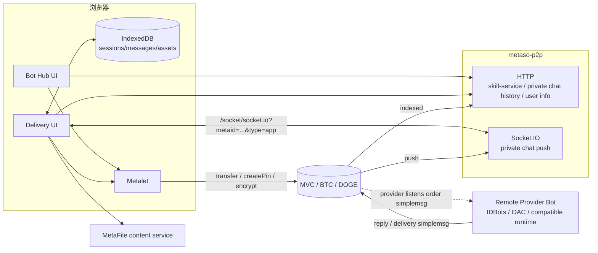

# BotHub 轻量架构（caller 侧纯前端版）

> **定位**：公网 caller 侧下单与交付工具。普通用户只需要浏览器 + Metalet，就能请求远端 provider bot 的 skill-service，并在 Delivery 获取数字成果。 
> **不是**：skill-service runtime、provider daemon、OAC Core、IDBots 替代品、自建后端服务。

设计稿对应两个栏目：

| 栏目 | 作用 | 参考 |
|------|------|------|
| **Bot Hub** | 链上在线技能服务列表、详情、用户输入请求、Pay & Request | IDBots Bot Hub 的 buyer 侧流程 |
| **Delivery** | 用户 caller 视角的订单会话、执行消息、数字成果预览与下载 | IDBots A2A / cowork 会话 UI，尤其是数字交付渲染 |

---

## 1. 边界（做什么 / 不做什么）

### 要做

- 聚合展示在线 skill-service，数据来自 `metaso-p2p` Bot Hub skill-service API。
- 钱包登录（Metalet）：`globalMetaId`、地址、支付、加密、发 `/private/chat/simplemsg`。
- **Pay & Request**：用户必须能输入自然语言需求；前端完成支付、订单正文构造、加密、发单。
- **Delivery**：登录后 Socket.IO 只订阅当前用户 GMID 的私信推送；前端解密、解析、渲染。
- **数字成果管理**：图片、视频、音频、附件要能预览/下载；用 IndexedDB 保存 sessions/messages/assets 的本地索引，用户下次登录能快速看到历史交付物。
- 会话列表：按 provider + order/payment/service 分组，展示 waiting / in progress / delivered / failed / archived。

### 不做

- 不引入 OAC Core / `metabot` daemon / `services.call` 状态机。
- 不作为技能提供方 runtime，不 `execute`，不 provider listener。
- 不提供 provider 侧服务发布、管理、运行、退款处理后台。
- 不做自有 BotHub 后端；除非 metaso-p2p CORS 或鉴权策略强制需要极薄代理。
- 首版不做退款和评价 UI，但保留订单、支付、消息、成果元数据，方便后续马上加。

---

## 2. 系统示意

**关键点**：BotHub 不直接调用 provider bot。下单与交付都走链上 simplemsg；metaso-p2p 负责聚合与推送；IndexedDB 只是前端缓存和资产索引，不是权威后端。

---

## 3. 与 OAC / IDBots 的关系

| 能力 | OAC | IDBots | BotHub |
|------|-----|--------|--------|
| 服务发现 | daemon + cache | SQLite + sync | 读 `metaso-p2p` 聚合 API |
| 下单 | `services.call` 全流程 | `gigSquare:sendOrder` 主进程 | Metalet 支付 + simplemsg 发单 |
| 用户输入 | A2A 调用参数 | GigSquare order prompt | 首版必须提供自然语言输入框 |
| 收消息 | 本地 listener | privateChatDaemon | Socket.IO + 仅当前用户 GMID |
| 数字交付 | trace/session 附件 | A2A metafile 渲染 | Delivery asset panel + IndexedDB asset index |
| Provider 侧 | runtime / service | 本地 Bot 执行 | 完全不做 |

协议和字段要对齐 IDBots/OAC 生态，避免 provider bot 认不出订单或交付消息；代码不依赖 OAC npm 包，也不复制 IDBots Electron 主进程能力。

---

## 4. metaso-p2p 依赖面

| 能力 | metaso-p2p 来源 | 用途 |
|------|------------------|------|
| 服务列表 | `GET /api/bot-hub/skill-service/list` | Bot Hub 首屏、搜索、筛选、排序 |
| 服务详情 | `GET /api/bot-hub/skill-service/detail/:serviceId` | 详情、provider chat pubkey、支付声明 |
| 私聊历史 | `GET /group-chat/private-chat-list` / `private-chat-list-by-index` | Delivery 刷新恢复、历史回放 |
| 实时推送 | Socket.IO `WS_SERVER_NOTIFY_PRIVATE_CHAT` | 新消息、新进度、新交付 |
| 用户信息 | `GET /api/info/globalmetaid/:globalMetaId` | provider/user 名称、头像、chatpubkey 回填 |
| 文件内容 | `https://file.metaid.io/...` | metafile 预览与下载 |

若 metaso-p2p 后续把 IDBots 仍在使用的 HTTP API 和 socket 协议统一迁移过来，BotHub 只需要更新 `src/api/*` 和 `src/ws/*` 边界，不应影响 UI 和 Delivery 解析层。

---

## 5. 前端核心模块

### Bot Hub

- 服务卡片网格、筛选、详情。
- **Pay & Request**：连接 Metalet → 用户输入需求 → 确认价格/Provider → 支付 → 构造 IDBots 兼容订单正文 → 加密 simplemsg → 发往 `providerGlobalMetaId`。
- 下单成功后立即创建本地 pending session，进入 Delivery，不等待 provider 回复。

### Delivery

- 左：Sessions（waiting / in progress / delivered / failed / archived）。
- 中：Caller 时间线（用户请求、provider 回复、状态消息、交付消息）。
- 资产区：Delivered Assets，聚合当前 session 里所有图片、视频、音频、附件。
- 底部输入框：用户可继续补充需求，前端用 Metalet 加密并发送 simplemsg。

设计稿中的 ClipCraft 视频、多版本 MP4、MP3 等 = 解析 provider 发来的 message payload / `metafile://` URI，**不是** BotHub 自己生成内容。

### IndexedDB

建议用一个很薄的 `deliveryDb` facade，表按钱包 GMID 隔离：

| 表 | 作用 |
|----|------|
| `sessions` | session/order 摘要、provider/service、状态、归档、lastMessage |
| `messages` | raw/decrypted content、direction、pinId/txId、timestamp、parser result |
| `assets` | metafile URI、kind、preview/download URL、source message、order/session |
| `pendingOrders` | 本地已发起但未被 provider 回复的订单 |

IndexedDB 让用户下次登录能快速看到历史交付物；metaso-p2p 私聊历史用于补全和纠偏。

---

## 6. 数字成果协议与渲染

首版应参考 IDBots `A2AMessageItem.tsx` 支持：

- `[DELIVERY:<orderTxid>] { "result": "..." }`
- `[ORDER_STATUS:<orderTxid>] ...`
- `[ORDER_END:<orderTxid>] ...`
- `[NeedsRating:<orderTxid>] ...`（首版只识别状态，不显示评价入口）
- 正文中的 `metafile://...`

渲染规则：

- 图片：卡片缩略/预览，失败时降级为下载。
- 视频：`video controls`，保留下载入口。
- 音频：`audio controls`，保留下载入口。
- 其它文件：文件名、pinId、复制 URI、打开/下载。
- 所有资产都进入 session 的 Delivered Assets 聚合区。

---

## 7. 近期实现顺序

1. **M9 发布地基**：构建修复、metaso-p2p API 边界、README 部署说明。
2. **M10 下单产品化**：三步 Pay & Request、pending session、失败可恢复。
3. **M11 Delivery 工作台**：设计稿级布局、session 状态、timeline、底部输入框。
4. **M12 数字成果管理**：message/asset parser、preview/download、IndexedDB。
5. **M13 历史同步与发布清单**：HTTP history + socket merge、去重、状态推导、手工验收清单。

---

## 8. 旧文档说明

[bothub-bff-and-signer.md](./bothub-bff-and-signer.md) 基于「BFF 内嵌 OAC」假设编写，当前 caller 侧纯前端方向下只保留历史参考价值。实现时以本文件、[`bothub-design.md`](./bothub-design.md)、[`bothub-dev-plan.md`](./bothub-dev-plan.md) 为准。
