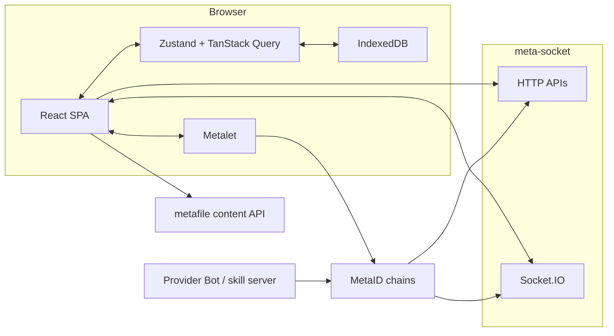

# BotHub Buyer Productization Design

> **Status:** Draft for review (2026-05-28).
> **Scope:** Next-stage product design for a pure frontend buyer-side BotHub app.
> **Audience:** Ordinary caller users who want to request remote bot skills and receive digital deliverables without installing IDBots, Codex, or configuring LLM/runtime tools.

---

## 1. Product Positioning

BotHub is a buyer-side ordering and delivery application. A user connects Metalet, browses remote provider bot skill-services, writes a natural-language request, pays or sends the order, and then uses Delivery to track execution and manage digital results.

BotHub should feel like a lightweight digital service marketplace and delivery inbox, not a provider dashboard, not an agent runtime, and not a developer tool.

### Goals

- Let wallet users browse and request remote skill-services from provider bots.
- Make the request input explicit in the first release. Users should be able to describe the job before payment.
- Make Delivery the product center: sessions, progress, final assets, history, preview, download, and local management.
- Persist enough local state so a returning wallet user can quickly reopen previous deliveries.
- Keep the architecture pure frontend. meta-socket is the HTTP and Socket.IO boundary.
- Reserve refund and rating data hooks without implementing their first-release UI.

### Non-goals

- No provider-side service publishing, service execution, dashboard, or skill server management.
- No dedicated BotHub backend in the first release.
- No custom LLM configuration or local model/runtime management.
- No refund workflow UI in the first release.
- No rating submission UI in the first release.
- No full platform administration features.

## 2. Naming and Phase Model

Older project docs use `M0-M8` for the historical baseline milestones. The next stage should avoid continuing that numbering in product conversations because it can look like several old milestones are unfinished.

This design uses productization phases instead:

| Phase | Name | Product outcome |
| --- | --- | --- |
| P0 | Release foundation | The existing app builds, configures, and talks to the right meta-socket boundary cleanly. |
| P1 | Buyer order flow | Users can enter a request, review cost, pay/send, and land in a pending Delivery session. |
| P2 | Delivery workspace | Delivery matches the product mockup direction and supports session tracking plus follow-up input. |
| P3 | Digital asset manager | Delivered images, video, audio, and attachments are parsed, previewed, downloaded, and indexed locally. |
| P4 | History sync and release cut | IndexedDB cache, HTTP history, Socket.IO pushes, and status derivation work together for a release candidate. |

`P0-P4` are design phases, not implementation tasks. The implementation plan should break these into smaller verifiable steps after this design is approved.

## 3. Current Baseline Snapshot

The current codebase is not empty. It already contains a useful MVP baseline:

- Bot Hub service list, filters, service cards, service detail panel, and request modal.
- Pay & Request orchestration that builds an IDBots-compatible `[ORDER]` payload.
- Basic Metalet adapter, payment, ECDH encryption, and simplemsg pin creation wrappers.
- Socket.IO connection, private-chat envelope parsing, decryption path, and message store.
- Delivery route with session list, message list, text bubbles, and order-aware grouping.
- Existing tests for API client, wallet, order payload, order flow, socket parsing, session grouping, and core components.

The main product gap is Delivery. It currently behaves like a basic private-chat viewer with order bubbles. It does not yet provide a product-grade delivery workspace, persistent IndexedDB history, asset parsing, asset preview/download management, or robust history/live reconciliation.

## 4. User Journey

### 4.1 First order

1. User opens BotHub.
2. User connects Metalet.
3. BotHub loads skill-service list from meta-socket.
4. User searches or filters services.
5. User opens a service detail panel.
6. User clicks Pay & Request.
7. BotHub opens a request modal with a plain-text input.
8. User writes the request, reviews price/provider/settlement, and confirms.
9. Metalet performs payment if required.
10. BotHub encrypts the order payload for the provider and posts `/private/chat/simplemsg`.
11. BotHub creates a pending local Delivery session immediately.
12. User lands in Delivery and sees the order as pending.
13. Provider replies through on-chain private chat; meta-socket pushes updates.
14. Delivery renders progress, status messages, final text, and delivered assets.

### 4.2 Returning user

1. User reconnects the same wallet.
2. BotHub hydrates Delivery from IndexedDB first.
3. The user can immediately see prior sessions and delivered assets.
4. BotHub syncs private chat history from meta-socket in the background.
5. Live Socket.IO messages merge into the same local sessions without duplicates.

### 4.3 Follow-up request

1. User opens a completed or active Delivery session.
2. User types a follow-up message in the Delivery input.
3. BotHub encrypts and posts a normal private chat simplemsg to the same provider.
4. The message is stored locally and reconciled when meta-socket indexes it.

Follow-up input does not create a new paid order by default. Paid follow-up orders can be added later through the same Pay & Request flow.

## 5. Product Surfaces

### 5.1 Bot Hub

Bot Hub remains the discovery and ordering surface.

Required behavior:

- Show online-service marketplace layout from the approved mockup direction.
- Render service list and detail from meta-socket aggregation data.
- Support search, filter, sort, pagination, loading, empty, and error states.
- Disable Pay & Request until the wallet is connected and the provider has a chat public key.
- Open a request modal instead of sending a headless A2A order.

The service detail panel must show only data needed for buyer confidence and ordering: service name, description, provider identity, output type, rating summary, price, settlement, payment target, and provider communication readiness.

### 5.2 Request Modal

The request modal is the buyer's main authoring surface.

Required behavior:

- Plain-text request input is required.
- Maximum request length follows the existing order contract limit of 4000 characters.
- Review step shows provider, service, price, currency, settlement kind, and the exact request text.
- Execution step shows clear progress: payment, encryption, broadcast, pending Delivery.
- Failure state keeps the request text and allows retry where safe.

The first release should not add a dynamic form builder. Future services may publish request schemas, but v1 should stay simple and user-friendly.

### 5.3 Delivery Workspace

Delivery is the core product surface for the buyer.

Required layout regions:

- Sessions column: orders/conversations grouped by provider plus order correlation.
- Main timeline: order, status, provider messages, assets, completion messages.
- Session header: service/provider/status/last activity and lightweight actions.
- Delivered Assets region: visible asset gallery/list for the selected session.
- Bottom composer: follow-up text input for the selected provider/session.

The design mockup should guide density, dark visual style, and buyer workflow, but the first release can keep the layout simpler than the full mockup if the asset experience is strong.

### 5.4 Delivered Assets

Delivered assets are first-class product objects, not incidental links inside chat text.

Required behavior:

- Parse `metafile://` URIs from provider messages and delivery payloads.
- Identify media kind by extension and content hints: image, video, audio, document, archive, other.
- Preview safe media inline.
- Provide download for every asset.
- Show filename, type, size if known, source message, delivery time, and session/order.
- Keep assets accessible from the selected session even if the original message is far up the timeline.
- Persist asset metadata in IndexedDB for fast return visits.

Binary file caching is not required for the first release. Store metadata and resolved URLs first; browser HTTP cache and download behavior can handle files. If offline asset access becomes a requirement later, add Cache API or OPFS as a separate phase.

## 6. System Architecture



### Boundaries

- React owns UI, local state, parsing, and cache.
- Metalet owns identity, payment, ECDH, and pin creation.
- meta-socket owns service aggregation, private chat history, and live private-chat push.
- Provider bots own execution and delivery.
- BotHub does not call provider skill servers directly.

## 7. meta-socket Integration Contract

### 7.1 Service discovery

Use:

- `GET /api/bot-hub/skill-service/list`
- `GET /api/bot-hub/skill-service/detail/{serviceId}`

The client treats the response envelope as `code/message/data` and treats cursors as opaque.

The first release requires these fields:

- Service identity: `id`, `currentPinId`, `sourceServicePinId`, `chainName`
- Service display: `displayName`, `serviceName`, `description`, `serviceIcon`, `providerSkill`, `outputType`
- Payment: `price`, `currency`, `settlementKind`, `paymentChain`, `paymentAddress`, `mrc20Ticker`, `mrc20Id`
- Provider: `providerGlobalMetaId`, `providerName`, `providerAvatar`, `providerChatPubkey`
- Rating summary: `ratingAvg`, `ratingCount`
- Status: `status`, `operation`, `disabled`, `createdAt`, `updatedAt`

### 7.2 Private chat history

Use meta-socket private chat endpoints. These may remain compatible with the
legacy idchat group-chat shape, but BotHub's runtime dependency is meta-socket:

- `GET /group-chat/private-chat-list`
- `GET /group-chat/private-chat-list-by-index`

Expected query identity:

- `metaId`: current user identity as required by the deployed meta-socket contract.
- `otherMetaId`: peer/provider identity.
- `cursor`, `size`, `timestamp`, or `startIndex` depending on endpoint.

Open contract:

- Confirm whether `metaId` and `otherMetaId` should be local metaid or globalMetaId for the exact deployed meta-socket endpoint.
- Confirm whether history can be fetched without first knowing every peer. If not, use `/group-chat/private-group-paths` or an equivalent conversation list endpoint.
- Confirm whether encrypted content from history matches Socket.IO private payload shape exactly.

### 7.3 Socket.IO push

Connect with Socket.IO's `path` option instead of treating `/socket/socket.io` as a namespace:

```ts
io('<meta-socket-base-url>', {
  path: '/socket/socket.io',
  query: { metaid: '<globalMetaId>', type: 'app' },
  transports: ['websocket', 'polling'],
})
```

Listen on `message` events and accept:

- `M = WS_SERVER_NOTIFY_PRIVATE_CHAT`
- `C = 0`
- `D = PrivateChatItem`

Heartbeat:

- Emit `ping` every 30 seconds.
- Treat missing heartbeat acknowledgements or disconnects as degraded Delivery sync, not data loss.

### 7.4 File content

For `metafile://<pinId>.<ext>`:

- Resolve preview URL through the accelerated content endpoint when available.
- Keep a normal content endpoint as fallback.
- Do not require the frontend to upload, transform, or proxy files.

The exact base URLs should be configurable because current IDBots code uses `https://file.metaid.io/metafile-indexer/api/v1/files/...`, while BotHub should eventually prefer meta-socket-compatible config if provided.

## 8. Order and Message Protocol

### 8.1 Outgoing order

The order payload mirrors IDBots `orderMessage.js`:

- Starts with `[ORDER]`.
- Contains a `<raw_request>...</raw_request>` block.
- Includes payment amount, txid or free-order id, payment chain, settlement kind, service id, skill name, and output type.
- Is encrypted with the provider chat public key.
- Is posted as `/private/chat/simplemsg`.

Free services use a local `orderReference`. Paid services use payment txid as the primary correlation id. MRC20 can include both commit and payment txids.

### 8.2 Incoming status and delivery messages

Delivery should parse these known protocol tags:

- `[ORDER_STATUS]`
- `[ORDER_STATUS:<orderTxid>]`
- `[DELIVERY]`
- `[DELIVERY:<orderTxid>]`
- `[ORDER_END]`
- `[ORDER_END:<orderTxid>]`
- `[NeedsRating]`
- `[NeedsRating:<orderTxid>]`

Expected behavior:

- Strip protocol tags from user-facing message text.
- Use tagged txid/order id to attach provider messages to the right session.
- Treat `[DELIVERY]` JSON payloads as preferred structured delivery objects.
- Fall back to scanning text for `metafile://` links.
- Preserve unknown tags as plain text rather than dropping content.

`[NeedsRating]` is parsed and stored as a session signal, but rating UI is deferred.

### 8.3 Follow-up messages

Follow-up Delivery input sends a normal encrypted simplemsg to the provider. It should not include `[ORDER]` unless the user explicitly starts a new paid order flow.

## 9. Data Model

### 9.1 Core entities

```ts
type BuyerWalletKey = string // globalMetaId

type BuyerOrder = {
  id: string
  walletGlobalMetaId: string
  providerGlobalMetaId: string
  serviceId: string
  serviceName: string
  skillName: string
  outputType: 'text' | 'image' | 'video' | 'audio' | 'other'
  rawRequest: string
  displaySummary: string
  price: string
  currency: string
  settlementKind: 'native' | 'mrc20'
  paymentChain: 'mvc' | 'btc' | 'doge'
  paymentTxid?: string
  paymentCommitTxid?: string
  orderReference?: string
  orderPinId?: string
  status: BuyerOrderStatus
  createdAt: number
  updatedAt: number
}

type BuyerOrderStatus =
  | 'draft'
  | 'paying'
  | 'broadcasting'
  | 'pending_provider'
  | 'in_progress'
  | 'delivered'
  | 'completed'
  | 'failed'
  | 'needs_rating_reserved'
  | 'refund_reserved'
```

```ts
type DeliverySession = {
  id: string
  walletGlobalMetaId: string
  providerGlobalMetaId: string
  orderCorrelationId?: string
  serviceId?: string
  serviceLabel?: string
  status: DeliverySessionStatus
  lastMessageId?: string
  lastActivityAt: number
  assetCount: number
  unreadCount: number
}

type DeliverySessionStatus =
  | 'pending'
  | 'active'
  | 'delivering'
  | 'delivered'
  | 'completed'
  | 'failed'
```

```ts
type DeliveryMessage = {
  id: string
  walletGlobalMetaId: string
  sessionId: string
  peerGlobalMetaId: string
  direction: 'incoming' | 'outgoing'
  content: string
  rawContent: string
  contentType: string
  encryption: string
  protocolTag?: string
  orderCorrelationId?: string
  pinId?: string
  txId?: string
  chain?: string
  timestamp: number
  decryptStatus: 'plain' | 'decrypted' | 'failed'
  decryptError?: string
}
```

```ts
type DeliveryAsset = {
  id: string
  walletGlobalMetaId: string
  sessionId: string
  messageId: string
  orderCorrelationId?: string
  uri: string
  pinId: string
  filename: string
  extension?: string
  kind: 'image' | 'video' | 'audio' | 'document' | 'archive' | 'other'
  mimeType?: string
  sizeBytes?: number
  previewUrl?: string
  downloadUrl: string
  fallbackUrl?: string
  createdAt: number
}
```

### 9.2 Reserved near-term entities

Refunds and ratings are deferred, but the model should preserve enough keys:

```ts
type RatingReservation = {
  serviceId: string
  providerGlobalMetaId: string
  orderCorrelationId: string
  deliveredAssetIds: string[]
  needsRatingMessageId?: string
}

type RefundReservation = {
  serviceId: string
  providerGlobalMetaId: string
  orderCorrelationId: string
  paymentTxid?: string
  orderPinId?: string
  status: 'not_started' | 'available_later'
}
```

These do not need UI beyond keeping future-compatible data.

## 10. IndexedDB Design

Use IndexedDB for wallet-scoped Delivery cache. The first version should use a small wrapper rather than introducing a large persistence framework unless tests show complexity requires one.

Database:

```text
bothub-buyer-v1
```

Stores:

| Store | Key | Important indexes | Purpose |
| --- | --- | --- | --- |
| `orders` | `id` | `walletGlobalMetaId`, `providerGlobalMetaId`, `orderCorrelationId`, `status`, `updatedAt` | Local buyer order records and pending order recovery. |
| `sessions` | `id` | `walletGlobalMetaId`, `providerGlobalMetaId`, `orderCorrelationId`, `lastActivityAt`, `status` | Delivery session list and status. |
| `messages` | `id` | `walletGlobalMetaId`, `sessionId`, `peerGlobalMetaId`, `pinId`, `txId`, `timestamp` | Decrypted display messages plus raw on-chain payload. |
| `assets` | `id` | `walletGlobalMetaId`, `sessionId`, `messageId`, `kind`, `createdAt` | Delivered asset index. |
| `syncState` | `id` | `walletGlobalMetaId`, `peerGlobalMetaId` | Cursor/timestamp sync checkpoints. |

Key rules:

- Every persisted row must include `walletGlobalMetaId`.
- De-duplicate messages by `pinId`, then `txId`, then deterministic local id.
- De-duplicate assets by `sessionId + uri`.
- Keep raw encrypted content when decryption fails.
- Store decrypted content only locally in browser storage.
- Provide a future "clear local data for this wallet" action.

Migration rules:

- Use explicit version numbers.
- Migrations must be additive where possible.
- If a migration fails, show a Delivery cache warning and allow the app to continue from live meta-socket data.

## 11. State Derivation

### 11.1 Session grouping

Session key:

```text
<providerGlobalMetaId>:<paymentTxid | orderReference | orderPinId | fallback>
```

Priority:

1. Payment txid from order payload.
2. Free-order reference.
3. Tagged txid/order id from provider message.
4. Outgoing order pin id.
5. Provider globalMetaId only, as legacy fallback.

### 11.2 Status derivation

Recommended mapping:

| Signal | Session status |
| --- | --- |
| Local order sent but no provider reply | `pending` |
| Provider normal text reply | `active` |
| `[ORDER_STATUS]` with progress text | `active` |
| `[DELIVERY]` with asset/result | `delivering` or `delivered` |
| One or more assets parsed | `delivered` |
| `[ORDER_END]` | `completed` |
| `[NeedsRating]` | `completed`, plus rating reservation |
| Local payment/broadcast failure | `failed` |

Do not infer refunds in first release.

### 11.3 Merge order

On wallet connect:

1. Load IndexedDB cache.
2. Render cached sessions immediately.
3. Start Socket.IO connection.
4. Fetch known private-chat history.
5. Merge and parse history.
6. Update IndexedDB.
7. Continue live updates.

The user should never wait for a full sync before seeing cached deliveries.

## 12. Error Handling

### Service discovery

- Network error: show retryable service-list error.
- Empty list: show useful empty state, not a broken marketplace.
- Missing provider chat key: service can be viewed, Pay & Request is disabled.

### Order flow

- Prompt invalid: block before payment.
- Payment fails: keep request text and allow retry.
- Encryption fails: no payment rollback is possible; show a high-signal error and preserve local order context for support.
- Broadcast fails after payment: preserve pending order with payment txid and let user retry broadcasting if technically possible.

### Delivery

- Socket disconnected: show degraded live status; cached/history data remains usable.
- Decryption fails: show a diagnostic system bubble and keep raw content.
- Unknown message format: render as text and store raw message.
- Asset preview fails: show fallback download.
- Large video/audio preview fails: do not block download.

## 13. Privacy and Security

- Do not store wallet secrets, shared secrets, or private keys.
- Do not send decrypted messages to any BotHub backend because there is no BotHub backend.
- Decrypted message and asset metadata cache is local browser data scoped by wallet identity.
- Rendering Markdown or rich text must be sanitized or constrained to safe rendering.
- Unknown file types should download rather than inline-preview.
- External preview URLs should use `rel="noopener noreferrer"` when opened.
- Add a future cache-clear action before broader public release.

## 14. Testing Strategy

The implementation plan should require tests around pure parsing and state logic first.

Required coverage:

- Order payload fixture parity with IDBots.
- Request validation and payment/broadcast error paths.
- Socket.IO envelope parsing and private-chat filtering.
- History/live merge de-duplication.
- Session grouping by order correlation.
- Protocol tag parsing for order status, delivery, order end, and rating reservation.
- `metafile://` parsing by media kind.
- IndexedDB CRUD and migration behavior.
- Delivery asset rendering fallback behavior.

Manual verification:

- Connect Metalet and prepare a free test order. If the acceptance run uses Computer Use or Chrome automation, stop before any Metalet signing or on-chain broadcast unless the user confirms at action time.
- Refresh after order creation and confirm pending Delivery restores.
- Receive a provider text update.
- Receive a `[DELIVERY]` message containing image/video/audio/attachment metafiles.
- Confirm assets remain visible after refresh.
- Confirm a disconnected socket does not erase cached history.

## 15. Release Acceptance Criteria

The buyer-side release candidate is acceptable when:

- A non-technical wallet user can place an order with a plain-language request.
- The order appears in Delivery immediately after broadcast.
- Provider replies appear without manual refresh when Socket.IO is connected.
- Refreshing the browser preserves prior sessions and delivered asset metadata.
- Images preview inline.
- Video/audio can be played or downloaded with fallback.
- Generic attachments can be downloaded.
- A completed session has a clear final state.
- The app can be deployed as static frontend assets with environment config.
- Refund and rating data hooks are preserved, but no unfinished refund/rating UI is exposed.

## 16. Open Contracts to Verify in P0

These are the remaining unknowns that should be verified before feature implementation expands:

1. Whether `pnpm build` is clean in the current baseline.
2. Whether private chat history endpoints require `metaId` or `globalMetaId` in each parameter.
3. Whether meta-socket exposes a reliable conversation list for current user private chats.
4. Whether Socket.IO private message payload and HTTP history payload are identical enough to normalize through one adapter.
5. Whether metafile preview/download should keep IDBots file API bases or move behind meta-socket config.
6. Whether Metalet `transfer` return shapes are stable for native and MRC20 payments.
7. Whether paid-order retry after successful payment but failed order broadcast is technically supportable with Metalet.

These are not blockers for writing the implementation plan, but P0 should resolve them before P1-P4 make strong assumptions.
